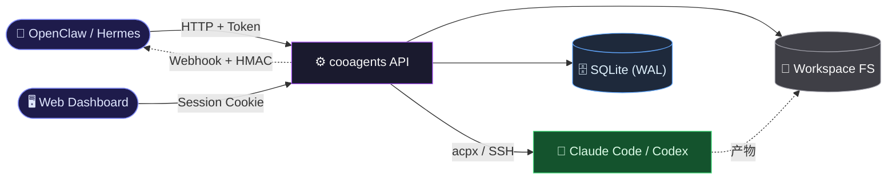

# cooagents

**Workspace 驱动的多 Agent 协作编排系统** —— 用 HTTP API 驱动 Claude Code / Codex 完成「设计 → 开发 → 准出」全闭环，由打分驱动的状态机自动收敛，人工只在四个关键点介入。



## 目录

- [核心概念](#核心概念)
- [核心特性](#核心特性)
- [快速启动](#快速启动)
- [配置](#配置)
- [宿主集成](#宿主集成)
- [存储与多 Agent 文件共享](#存储与多-agent-文件共享)
- [API 参考](#api-参考)
- [事件与 Webhook](#事件与-webhook)
- [Success Metrics](#success-metrics)
- [Dashboard](#dashboard)
- [项目结构](#项目结构)
- [测试](#测试)
- [License](#license)

## 核心概念

v1 是**破坏性重构**后的 Workspace 模型。旧的 15 阶段线性 Run、artifact/merge_queue/agent_hosts 等表全部废弃。

| 概念 | 定义 | 存储 |
|------|------|------|
| **Workspace** | 并行工作的容器；磁盘上一个独立文件夹 + `workspace.md` 索引；本身不进 Git。 | `workspaces` 表 + `$WORKSPACES_ROOT/<slug>/` |
| **DesignWork** | 产出 SemVer 版本化设计文档的状态机（D0→D7），打分循环 ≤ `design.max_loops`（默认 3）。 | `design_works` 表 |
| **DesignDoc** | DesignWork 成功产出的 `DES-<slug>-<SemVer>.md`；只增、不改。 | `design_docs` 表 + `workspaces/<slug>/designs/` |
| **DevWork** | 指定代码仓库的 git worktree 内执行的 5 步状态机：校验 → 迭代设计 → 上下文 → 开发+自审 → 审核打分。 | `dev_works` 表 |
| **DevIterationNote** | DevWork Step2 产出的工作簿 markdown；含轮次 / 计划 / 动态用例 / Step5 反馈。 | `dev_iteration_notes` 表 |
| **Review** | Step5 / D5 的评分记录（score、issues、`problem_category`）。 | `reviews` 表 |
| **Gate** | 闸门审批（v1 只有 DevWork 的 `exit` gate）；状态 `waiting/approved/rejected`。 | `dev_works.gates_json` |
| **Workspace Event** | 统一事件总线，Webhook 与 Metrics 共用同一事件 ID。 | `workspace_events` 表 |

**人工介入点只有四个**：创建 Workspace、写首份设计、挑设计版本、准出审批。其余全自动。

**DevWork 回跳路由按 `problem_category` 分流**：`req_gap` / `impl_gap` / `design_hollow`；累计轮次超阈值触发 `dev_work.escalated`。

## 核心特性

- **Workspace 驱动** — 磁盘 + DB 双向投影，启动时 `reconcile()` 校验；单 DevWork/DesignDoc 通过 partial UNIQUE index 强制串行。
- **OSS 同步备份 + 跨主机文件平面** — 可选启用阿里云 OSS 作为工作区制品的权威备份；`workspace_files` 表记 `relative_path + sha256 + byte_size`，每次 `register()` 走"本地原子写 → PUT OSS → DB upsert"。Agent 执行节点上的 `cooagents-worker` 通过 `GET /workspaces/{id}/files` 拉清单、`HEAD/GET` OSS 反向 materialize、`POST /workspaces/{id}/files` 携 `X-Expected-Prior-Hash` 做 CAS 写回。关闭 OSS 时仅本地落盘，行为零变更。
- **远程 Agent 调度** — `agent_hosts` 注册表 + `agent_dispatches` 生命周期行 + `SshDispatcher` + `HealthProbeLoop`；DesignWork / DevWork 行带 `agent_host_id`，可把单次 LLM 调用派发到指定 SSH 主机执行 `cooagents-worker run`。
- **双状态机** — DesignWork（D0–D7，11 态）+ DevWork（STEP1–STEP5，8 态），单写入者，幂等 `tick`。
- **打分驱动迭代** — Step5 reviewer 输出 `score + problem_category`，SM 自行决定回跳到 Step2/3/4 或收敛。
- **版本化设计产物** — SemVer `1.0.0` + `content_hash` (SHA-256) + `byte_size`；`published` 后不可修改。
- **Exit Gate** — `config.devwork.require_human_exit_confirm=true` 时挂起等待人工审批；`POST /api/v1/gates/.../approve` 释放。
- **Webhook 契约** — `StrEnum` 冻结事件名（21 个）；`X-Cooagents-Signature: sha256=…` HMAC；`event_id` 消费者去重。
- **Metrics 投影** — `GET /api/v1/metrics/workspaces?since=&until=` 返回 PRD 四指标（active / HI per ws / FPS / avg rounds），纯只读聚合。
- **多主机 Agent 池** — 本地 + SSH 远程（asyncssh）；`SshDispatcher` 远程执行 `cooagents-worker run`，`HealthProbeLoop` 周期性探活；`acpx` 适配 Claude/Codex；`allowed_tools_{design,dev}` 可做工具白名单。
- **双宿主适配** — OpenClaw（私有 `/hooks/agent` + Bearer）与 Hermes（通用 webhook + HMAC）同端共存，启动时自动部署 Skill。
- **Dashboard** — React 18 + Vite + Tailwind + SWR 15s 轮询；WorkspaceDashboard / WorkspaceDetail / DesignWork / DevWork / CrossWorkspaceDevWork。
- **E2E 烟测** — `tests/test_smoke_e2e.py` 驱动真实 SM 走三条路径（happy / design-escalated / devwork-escalated）并回查 `/metrics/workspaces`。

**技术栈：** FastAPI · aiosqlite (WAL) · asyncssh · Pydantic v2 · Jinja2 · SlowAPI · argon2-cffi · PyJWT · React 18 · TypeScript · Tailwind · SWR · Vitest

## 快速启动

### 环境要求

- Python 3.11+
- git、Node.js（`acpx` 安装用）
- （可选）pandoc —— `.docx` ↔ `.md`
- （可选）Nginx / Caddy —— 公网部署终止 HTTPS

### 安装

```bash
git clone git@github.com:vaxtomis/cooagents.git
cd cooagents
bash scripts/bootstrap.sh
```

`bootstrap.sh` 做：Python/git/node 校验 → 安装 `acpx` → 创建 venv → `pip install -r requirements.txt` → `cd web && npm ci && npm run build` → 校验 `web/dist/index.html` → 建 `.coop/` 并初始化 SQLite schema。

### 生成启动凭据

四个环境变量缺一即拒绝启动：`ADMIN_USERNAME` / `ADMIN_PASSWORD_HASH` / `JWT_SECRET` / `AGENT_API_TOKEN`。

```bash
umask 077 && .venv/bin/python scripts/generate_password_hash.py \
  --username admin --password '<YOUR_STRONG_PW>' > .env
chmod 600 .env
```

### 启动

```bash
set -a && . ./.env && set +a
.venv/bin/uvicorn src.app:app --host 127.0.0.1 --port 8321
```

| 地址 | 说明 |
|------|------|
| `http://127.0.0.1:8321/` | Dashboard（需登录） |
| `http://127.0.0.1:8321/health` | 健康检查 `{"status":"ok"}` |
| `http://127.0.0.1:8321/docs` | Swagger UI |
| `http://127.0.0.1:8321/redoc` | ReDoc |

> 推荐用 `/cooagents-setup` Skill 一键完成安装 + 启动 + 注册 Agent 主机 + 写回宿主 env。

## 配置

### `config/settings.yaml`

关键字段（完整见文件）：

```yaml
server:   { host: 127.0.0.1, port: 8321 }      # 公网部署必走反向代理
database: { path: .coop/state.db }

acpx:
  permission_mode: approve-all
  ttl: 600
  model: null                       # 使用 agent 默认模型
  allowed_tools_design: null        # 工具白名单（逗号分隔）
  allowed_tools_dev: null

turns:  { design_max_turns: 3, dev_max_turns: 3 }
design: { max_loops: 3, execution_timeout: 600 }
scoring:{ default_threshold: 80 }

openclaw:
  deploy_skills: true
  targets: [{ type: local, skills_dir: "~/.openclaw/skills" }]
  hooks:
    enabled: false
    url: "http://127.0.0.1:18789/hooks/agent"
    token: ""                       # 建议 "$ENV:OPENCLAW_HOOK_TOKEN"

hermes:
  enabled: false
  skills_dir: "~/.hermes/skills"
  deploy_skills: true
  webhook:
    enabled: false
    url: "http://127.0.0.1:8644/webhook/cooagents"
    secret: ""                      # 建议 "$ENV:HERMES_WEBHOOK_SECRET"
    events: []

storage:
  oss:
    enabled: false                  # true = 用 OSS 做工作区制品权威源
    bucket: "cooagents-prod"
    region: "cn-hangzhou"
    endpoint: "https://oss-cn-hangzhou.aliyuncs.com"
    prefix: "workspaces/"           # 对象键前缀，可留空
    # access_key_id / access_key_secret：读 OSS_ACCESS_KEY_ID /
    # OSS_ACCESS_KEY_SECRET 环境变量；切勿提交明文到仓库
    access_key_id: ""
    access_key_secret: ""
```

### `config/agents.yaml`

```yaml
hosts:
  - id: local
    host: local
    agent_type: both            # claude + codex
    max_concurrent: 2
  - id: dev-server
    host: dev@10.0.0.5          # SSH
    agent_type: codex
    max_concurrent: 4
    ssh_key: ~/.ssh/id_rsa
    labels: [fast]

# SSH hardening (Phase 8a)。生产强烈建议保持 strict_host_key=true。
ssh_strict_host_key: true
ssh_known_hosts_path: ~/.ssh/known_hosts
ssh_key_allowed_roots:          # ssh_key 必须落在这些根之下
  - ~/.ssh
```

启动时 `agent_host_repo.sync_from_config()` 会把 `hosts:` 投射进 `agent_hosts` 表；
`HealthProbeLoop` 按 `health_check.interval` 周期性 SSH 探活（`acpx --version` +
`$WORKSPACES_ROOT` 可写检查）。每台远端主机需安装 `pip install
'cooagents[worker]'`，详见 [docs/agent-worker.md](docs/agent-worker.md)。

### `.env`（权限 600）

```dotenv
ADMIN_USERNAME=admin
ADMIN_PASSWORD_HASH=$argon2id$v=19$m=...
JWT_SECRET=...
AGENT_API_TOKEN=...
# 可选：
HERMES_WEBHOOK_SECRET=...
OPENCLAW_HOOK_TOKEN=...
FEISHU_WEBHOOK_URL=...
COOAGENTS_CONFIG_DIR=config
COOAGENTS_COOP_DIR=.coop
# OSS 启用时必需（storage.oss.enabled=true）：
OSS_BUCKET=cooagents-prod
OSS_REGION=cn-hangzhou
OSS_ENDPOINT=https://oss-cn-hangzhou.aliyuncs.com
OSS_ACCESS_KEY_ID=LTAI...
OSS_ACCESS_KEY_SECRET=...
```

> `load_settings` 同时支持把这些值写在 `config/settings.yaml` 的
> `storage.oss.*` 槽里；环境变量**只在 YAML 槽为空时**回填，不会反向覆盖
> 已显式配置的 YAML 值。

### 开发环境升级（Phase 2 及以后）

Phase 2 引入 `workspace_files` 表并将若干 `*_path` 字段语义改为
工作区相对路径，**不提供历史数据迁移脚本**。开发者升级时：

```bash
rm -rf .coop/state.db
rm -rf "$WORKSPACES_ROOT"/*
```

然后重启服务即可。首次生产部署前再补历史回填脚本（见 PRD
`oss-file-storage-upgrade.prd.md` §Historical Data Migration）。

> OSS 启用后的持久化与恢复细节：见 [存储与多 Agent 文件共享](#存储与多-agent-文件共享)。

## 宿主集成

cooagents 同时支持两种宿主；可单启、也可并存（`{runtime}=both`）。启动时 `src/skill_deployer.py` 把 `skills/cooagents-{setup,upgrade}/` 同步到宿主的 `skills/` 目录。

| 维度 | OpenClaw | Hermes |
|------|----------|--------|
| 推送协议 | 私有 `/hooks/agent` + `Authorization: Bearer` | 通用 webhook route + `X-Cooagents-Signature` HMAC-SHA256 |
| Skill 路径 | `~/.openclaw/skills/<name>/` | `~/.hermes/skills/<name>/` |
| CLI | `openclaw` | `hermes` |
| env 注入 | `openclaw config set env.KEY VAL` | 追加到 `$(hermes config env-path)` |
| 重启 | `openclaw restart` | `hermes gateway restart` |

### OpenClaw（一键）

1. 从仓库复制 `skills/cooagents-setup/` → `~/.openclaw/skills/cooagents-setup/`。
2. 在 OpenClaw 对话里 `/cooagents-setup`，按提示填 `repo_path` 和 `admin_password`，Skill 自动：安装 → 启动 → 注册 Agent 主机 → 写回 `openclaw.hooks.*` 与 `env.AGENT_API_TOKEN`。

手动补 hooks：

```bash
HOOKS_TOKEN=$(python3 -c 'import secrets; print(secrets.token_hex(32))')
openclaw config set hooks.enabled true --strict-json
openclaw config set hooks.token "$HOOKS_TOKEN"
openclaw config set hooks.defaultSessionKey "hook:ingress"
openclaw config set hooks.allowedSessionKeyPrefixes '["hook:"]' --strict-json
openclaw config set env.AGENT_API_TOKEN "$AGENT_API_TOKEN"
# 在 cooagents config/settings.yaml 的 openclaw.hooks.token 填同一个值
```

### Hermes（一键）

1. 从仓库复制 `skills/cooagents-setup/` → `~/.hermes/skills/cooagents-setup/`。
2. 在 Hermes 里 `/cooagents-setup`，Skill 自动走 Hermes 分支：生成 HMAC secret、写入 `~/.hermes/.env`、注册 webhook route、订阅事件、注入 `AGENT_API_TOKEN`。

手动配置核心步骤：

```bash
HERMES_SECRET=$(python3 -c 'import secrets; print(secrets.token_hex(32))')
printf "HERMES_WEBHOOK_SECRET=%s\nAGENT_API_TOKEN=%s\n" \
  "$HERMES_SECRET" "$AGENT_API_TOKEN" >> "$(hermes config env-path)"
chmod 600 "$(hermes config env-path)"
printf "\nHERMES_WEBHOOK_SECRET=%s\n" "$HERMES_SECRET" >> .env
```

Hermes `config.yaml`：

```yaml
platforms:
  webhook:
    enabled: true
    extra:
      host: 127.0.0.1
      port: 8644
      routes:
        cooagents:
          events: ["*"]
          secret: "${HERMES_WEBHOOK_SECRET}"
          skills: ["cooagents-workflow"]
          deliver: "log"
```

向 cooagents 注册订阅：

```bash
curl -X POST http://127.0.0.1:8321/api/v1/webhooks \
  -H "X-Agent-Token: $AGENT_API_TOKEN" \
  -H "Content-Type: application/json" \
  -d "{\"url\":\"http://127.0.0.1:8644/webhook/cooagents\",
       \"events\":[\"dev_work.gate.exit_waiting\",\"dev_work.completed\",
                   \"dev_work.escalated\",\"workspace.human_intervention\"],
       \"secret\":\"$HERMES_SECRET\"}"
```

## 存储与多 Agent 文件共享

cooagents 的架构是：**一台控制服务器（cooagents：单 SQLite DB + HTTP API + 文件 IO）+ 一个通过 SSH 派发的 Agent 执行节点池**。Phase 1–7b 完成控制平面侧的文件抽象、相对路径化、`workspace_files` 元数据清单，以及把写入的字节同步备份到 OSS；Phase 8 在 Agent 执行节点上引入 `cooagents-worker`，加上 CAS 写回路由，让"跨主机 Agent 看到对方产物"成立。

控制平面（cooagents）侧：

- `WorkspaceFileRegistry.register()` 走"本地原子写 → PUT OSS → DB upsert"两步序，OSS 失败即抛出（不会留下"DB upsert 但 OSS 缺对象"的状态）
- cooagents 是 DB 与 OSS 对象的**唯一写者**（FastAPI 单事件循环 + SQLite per-connection 序列化），CAS 在 `POST /workspaces/{id}/files` 边界由 `X-Expected-Prior-Hash` 强制
- 启动期 `reconcile()` 修正 FS↔DB 漂移；`agent_host_repo.sync_from_config()` 把 `agents.yaml` 投射进 DB

Agent 节点（`cooagents-worker`）侧：

- 一次 SSH 调用 = 一个 DevWork 或 DesignWork 单元：recovery scan → materialize（OSS 反向拉缺失字节，SHA-256 验真）→ spawn `acpx` → diff + `POST /workspaces/{id}/files` 写回
- `hash_mismatch` 失败闭合：本地手改的文件不会被覆盖，worker 退出 2 让操作员先 reconcile
- 详尽 runbook 见 [docs/agent-worker.md](docs/agent-worker.md)

路由细节见 [API 参考](#api-参考)；协议与不变量见 PRD `oss-file-storage-upgrade.prd.md`。

### 本地 vs OSS

| 维度 | `storage.oss.enabled=false`（默认） | `storage.oss.enabled=true` |
|------|----------------------------------|-----------------------------|
| 文件落地 | 本地磁盘 | 本地磁盘 + OSS 同步备份 |
| `/workspaces/sync` 语义 | FS-wins：目录存在→INSERT；DB 有、目录无→archived | 同左（Phase 7b 后单态） |
| 跨主机 Agent 派发 | 单机本地（`agent_host_id='local'`） | SSH 派发 `cooagents-worker`，OSS 反向 materialize + CAS 写回 |
| 灾难恢复 | 无（本地丢即丢） | 操作员从 OSS 控制台/脚本拉回字节 + cooagents `reconcile()`；或新机器指向同一桶让 worker 自动 materialize |
| 启动时 SDK 开销 | 零（`alibabacloud_oss_v2` 不导入） | OSS SDK 懒加载一次 |

### 启用 OSS

1. 准备一个阿里云 OSS 桶（专用于 cooagents；不要混用生产桶）。
2. 给 RAM 用户授权：`oss:PutObject / GetObject / HeadObject / DeleteObject / ListObjects`（无需桶级删除/配置权限）。
3. 在 `config/settings.yaml` 设置 `storage.oss.enabled: true` 并填 `bucket / region / endpoint / prefix`（见 [配置](#配置)）。
4. 在 `.env` 里写入 `OSS_ACCESS_KEY_ID` / `OSS_ACCESS_KEY_SECRET`（可选：其他 OSS 变量，如果你希望不写进 YAML）。
5. 重启服务。任一 OSS 必需字段缺失时启动**立即失败**，错误信息会列出缺失键名。

> 关闭时什么都不用做 —— `workspace_files` 表仍在记账（hash / size / mtime），既有 DesignWork/DevWork 行为零变更。

### 运维端点

走 `/api/v1` 前缀，需要 `X-Agent-Token`。

- **`POST /api/v1/workspaces/sync`** — 单态 FS-wins reconcile：本地有目录而 DB 无行 → INSERT active；DB active 而本地无目录 → 归档。限流 5/min。
- **`GET /api/v1/workspaces/{id}/files`** — 返回该工作区的 `workspace_files` 索引（worker 的 materialize 入口）。
- **`POST /api/v1/workspaces/{id}/files`** — multipart 上传 + `X-Expected-Prior-Hash`（CAS）。`"none"`/空/`"*"` 表示首写；hex 表示要求当前 `content_hash` 完全匹配。冲突返回 412 + `{current_hash, expected_hash}`。
- **`/api/v1/agent-hosts/*`** — 注册 / 列表 / 健康探测 / `sync` from `agents.yaml`。

### 本期能做 / 不能做

**能做**：

- OSS 启用态下，每次工作区写入都同步备份到 OSS（PUT 失败即抛错，不会留下"DB 行已 upsert 但 OSS 缺对象"的状态）
- cooagents 服务器搬家：备份 DB + 指向同一 OSS 桶，新机器起 cooagents 后下次 worker 派发会按 materialize 协议把对象拉回 `workspace_root`
- 单机故障重启：启动期 `reconcile()` 把 FS↔DB 漂移修正
- 跨主机 Agent 派发：`agents.yaml` 注册 SSH 主机 + `cooagents-worker` 安装到该主机，DesignWork/DevWork 的 `agent_host_id` 即可指向远端

**不能做**：

- cooagents 控制服务器多实例化（DB 仍是单副本，单写者）
- 操作员手动 materialize HTTP 路由（仍由内部 worker 协议触发，不开放给人类）
- 跨工作区文件去重（每次 PUT 即一次 OSS 对象，无 CAS dedupe）

### 故障排查

| 症状 | 原因 | 处理 |
|------|------|------|
| 启动报 `settings.storage.oss.enabled=true requires: [...]` | YAML/env 里缺 OSS 必需字段 | 按报错列表补齐；`load_settings` 在 `src/config.py` 实现，缺失即拒绝启动 |
| `register()` 抛 OSS 错（`OperationError` 等） | OSS PUT 失败（凭证 / 网络 / 桶策略） | 检查桶访问权限；OSS 错抛出后 DB 不会留下"无对应 OSS 对象"的行；下次相同 path 写入会重新 PUT |
| 本地 FS 与 DB 不一致 | cooagents 进程崩溃在 put_bytes 与 DB upsert 之间 | 重启服务触发 `WorkspaceManager.reconcile()`；本地存在但 DB 无 active 行 → INSERT |

> 协议与不变量：见 [`oss-file-storage-upgrade.prd.md`](.claude/PRPs/prds/oss-file-storage-upgrade.prd.md) §Technical Approach。

## API 参考

所有 `/api/v1/*`（`/auth/*` 除外）需 Session Cookie 或 `X-Agent-Token`（等于 `AGENT_API_TOKEN`）。完整 Swagger 见 `/docs`。

### Workspace

| Method | Path | 说明 |
|--------|------|------|
| POST | `/api/v1/workspaces` | 创建（同时落盘 scaffold） |
| GET | `/api/v1/workspaces?status=active` | 列表 |
| GET | `/api/v1/workspaces/{id}` | 详情 |
| DELETE | `/api/v1/workspaces/{id}` | 归档（status=archived） |
| POST | `/api/v1/workspaces/sync` | DB ↔ FS reconcile（单态 FS-wins，见「存储与多 Agent 文件共享」） |
| GET | `/api/v1/workspaces/{id}/events` | 只读事件流 |
| GET | `/api/v1/workspaces/{id}/files` | `workspace_files` 索引（worker materialize 入口） |
| POST | `/api/v1/workspaces/{id}/files` | multipart 写回；必带 `X-Expected-Prior-Hash` CAS；120/min |

### DesignWork / DesignDoc

| Method | Path | 说明 |
|--------|------|------|
| POST | `/api/v1/design-works` | 创建 DesignWork（进入 D0→D1） |
| GET | `/api/v1/design-works?workspace_id=X` | 列表 |
| GET | `/api/v1/design-works/{id}` | 详情 |
| POST | `/api/v1/design-works/{id}/tick` | 单步推进（幂等） |
| POST | `/api/v1/design-works/{id}/cancel` | 取消 |
| GET | `/api/v1/design-docs?workspace_id=X` | 设计文档索引 |
| GET | `/api/v1/design-docs/{id}` | 元数据 |
| GET | `/api/v1/design-docs/{id}/content` | Markdown 原文 |

### DevWork / IterationNote

| Method | Path | 说明 |
|--------|------|------|
| POST | `/api/v1/dev-works` | 创建 DevWork（准入自动完成） |
| GET | `/api/v1/dev-works?workspace_id=X` | 列表 |
| GET | `/api/v1/dev-works/{id}` | 详情 |
| POST | `/api/v1/dev-works/{id}/tick` | 单步推进 |
| POST | `/api/v1/dev-works/{id}/cancel` | 取消 |
| GET | `/api/v1/dev-works/{id}/iteration-notes` | 迭代记录索引 |
| GET | `/api/v1/dev-iteration-notes/{id}/content` | Markdown 原文 |

### Gate / Review / Metrics / Webhook

| Method | Path | 说明 |
|--------|------|------|
| GET | `/api/v1/gates/{gate_id}` | gate_id = `dev:<dev_work_id>:exit` |
| POST | `/api/v1/gates/{gate_id}/{approve\|reject}` | 准出审批，60/min 限流 |
| GET | `/api/v1/reviews?dev_work_id=X` | Step5 / D5 评分记录 |
| GET | `/api/v1/metrics/workspaces?since=&until=` | PRD 四指标聚合 |
| POST/GET/DELETE | `/api/v1/webhooks[/{id}]` | 订阅管理（新契约） |
| GET | `/api/v1/webhooks/{id}/deliveries` | 投递历史 |
| POST | `/api/v1/repos/ensure` | 克隆/拉取代码仓到指定路径 |

### Agent Hosts

| Method | Path | 说明 |
|--------|------|------|
| GET | `/api/v1/agent-hosts` | 列表（含 `health_status` / `last_health_at`） |
| GET | `/api/v1/agent-hosts/{id}` | 详情 |
| POST | `/api/v1/agent-hosts` | 注册（local / SSH 远端） |
| DELETE | `/api/v1/agent-hosts/{id}` | 注销 |
| POST | `/api/v1/agent-hosts/{id}/healthcheck` | 立即探活（SSH + `acpx --version` + `WORKSPACES_ROOT` 可写检查） |
| POST | `/api/v1/agent-hosts/sync` | 从 `config/agents.yaml` 重新投影 |

## 事件与 Webhook

出站信封（统一）：

```json
{
  "event": "<event_name>",
  "event_id": "<uuid>",
  "ts": "<ISO8601>",
  "workspace_id": "ws-...",
  "correlation_id": "<dev_work_id | design_work_id | ...>",
  "payload": { "...": "..." }
}
```

HTTP 头：

- `X-Cooagents-Event: <event_name>`
- `X-Cooagents-Signature: sha256=<hmac_hex>`（`body` 用订阅 `secret` 做 HMAC-SHA256）
- `X-Cooagents-Event-Id: <uuid>`（消费者去重用）

事件清单（冻结；见 [src/webhook_events.py](src/webhook_events.py)；契约快照测试 [test_envelope_contract.py](tests/test_envelope_contract.py)）：

| 分类 | 事件 |
|------|------|
| Workspace | `workspace.created` · `workspace.archived` · `workspace.human_intervention` |
| DesignWork | `design_work.started` · `design_work.llm_completed` · `design_work.mockup_recorded` · `design_work.round_completed` · `design_work.escalated` · `design_work.cancelled` |
| DesignDoc | `design_doc.published` |
| DevWork | `dev_work.started` · `dev_work.step_started` · `dev_work.step_completed` · `dev_work.round_completed` · `dev_work.score_passed` · `dev_work.escalated` · `dev_work.completed` · `dev_work.cancelled` |
| DevWork Gate | `dev_work.gate.exit_waiting` |
| DevWork Merge | `dev_work.merge_conflict`（forward-compat，v1 无 emit） |
| Internal | `webhook.delivery_failed`（投递失败自记录） |

> **注意**：不存在 `dev_work.gate.entry_waiting` —— 「准入」即用户 `POST /dev-works` 的动作本身，不是 SM 等待态。

## Success Metrics

`GET /api/v1/metrics/workspaces` 返回 PRD 四项指标：

```json
{
  "human_intervention_per_workspace": 1.25,
  "active_workspaces": 3,
  "first_pass_success_rate": 0.67,
  "avg_iteration_rounds": 2.1
}
```

| 字段 | 计算 | 说明 |
|------|------|------|
| `active_workspaces` | `COUNT(*) WHERE status='active'` | **不**随 `since/until` 窗口过滤 —— 这是「当前活跃」瞬时值 |
| `human_intervention_per_workspace` | `#HI events / #workspaces`（窗口内） | HI = `workspace.human_intervention` 事件 |
| `first_pass_success_rate` | 终态 `dev_works` 中 `first_pass_success=1` 的比例 | 分母是 `COMPLETED ∪ ESCALATED` |
| `avg_iteration_rounds` | 终态 `dev_works` 的 `iteration_rounds` 均值 | |

窗口参数：`?since=&until=` 接受 ISO8601（`Z` 后缀 / naive / 带偏移都支持，内部归一到 `+00:00`）。分母为 0 时返回 `0.0`（不会除零）。

## Dashboard

React 18 + Vite + Tailwind，SWR 15 秒轮询。

- **WorkspaceDashboard** —— 四块 HeroStat（直接取 `/metrics/workspaces`）+ 活跃 Workspace 清单
- **WorkspaceDetail** —— Workspace 元数据 + 所属 DesignDoc / DesignWork / DevWork 表
- **DesignWorkPage** —— D0→D7 状态机进度条 + LLM 轮次 + Review 打分
- **DevWorkPage** —— STEP1–STEP5 进度条 + IterationNote + Step5 打分 + exit-gate 审批面板
- **CrossWorkspaceDevWorkPage** —— 跨 Workspace 的 DevWork 聚合视图
- **AgentHostsPage** —— Agent 主机池状态
- **LoginPage** —— 基于 Session Cookie 的登录

## 项目结构

```text
cooagents/
├── config/                  settings.yaml · agents.yaml
├── db/schema.sql            11 表：workspaces / agent_hosts / agent_dispatches /
│                             design_docs / design_works / dev_works /
│                             dev_iteration_notes / reviews / workspace_events /
│                             workspace_files / webhook_subscriptions
├── docs/                    design / dev / internals / agent-worker.md ·
│                             openclaw-tools.json
├── scripts/                 bootstrap.sh · generate_password_hash.py
├── skills/                  cooagents-{setup,upgrade}/ —— 启动时部署到宿主
├── src/                     FastAPI app + 两个 SM + manager + webhook notifier
│   ├── agent_hosts/         AgentHostRepo / SshDispatcher / HealthProbeLoop
│   ├── agent_worker/        cooagents-worker CLI（装在 Agent 节点）
│   └── storage/             FileStore (Local / OSS) + WorkspaceFileRegistry
├── routes/                  HTTP 路由（每类实体一文件，含 agent_hosts）
├── templates/               Jinja2 任务指令模板（STEP* / TURN* / GATE* / 信封）
├── tests/                   pytest（含 test_smoke_e2e.py 三条端到端路径）
└── web/                     React + TS + Tailwind Dashboard
```

## 测试

```bash
# 全量
pytest tests/ -v

# 关键单测
pytest tests/test_design_work_sm.py tests/test_dev_work_sm.py
pytest tests/test_metrics_route.py tests/test_gates_route.py
pytest tests/test_envelope_contract.py      # 冻结事件契约
pytest tests/test_smoke_e2e.py              # 端到端三路径

# 前端
cd web && npx vitest run
```

覆盖面：SM（DesignWork / DevWork）、路由层（每个实体独立）、manager（workspace / design_doc / dev_iteration_note）、auth / database / git_utils / acpx_executor / reviewer / semver / file_converter / skill_deployer / webhook_notifier / openclaw_hooks。

### Running OSS integration tests

Set the following env vars before invoking `pytest tests/integration -v`:
- `OSS_BUCKET` — bucket name of the test bucket (NOT a prod bucket)
- `OSS_ENDPOINT` — e.g. `https://oss-cn-hangzhou.aliyuncs.com`
- `OSS_REGION` — e.g. `cn-hangzhou`
- `OSS_ACCESS_KEY_ID` / `OSS_ACCESS_KEY_SECRET` — RAM user credentials with `oss:PutObject`, `oss:GetObject`, `oss:DeleteObject`, `oss:HeadObject`, `oss:ListObjects` on the test bucket
- Set `OSS_RUN_SLOW=1` to additionally run the 1010-key pagination test

Tests auto-skip when any required variable is missing.

## License

MIT — 见 [LICENSE](LICENSE)。
