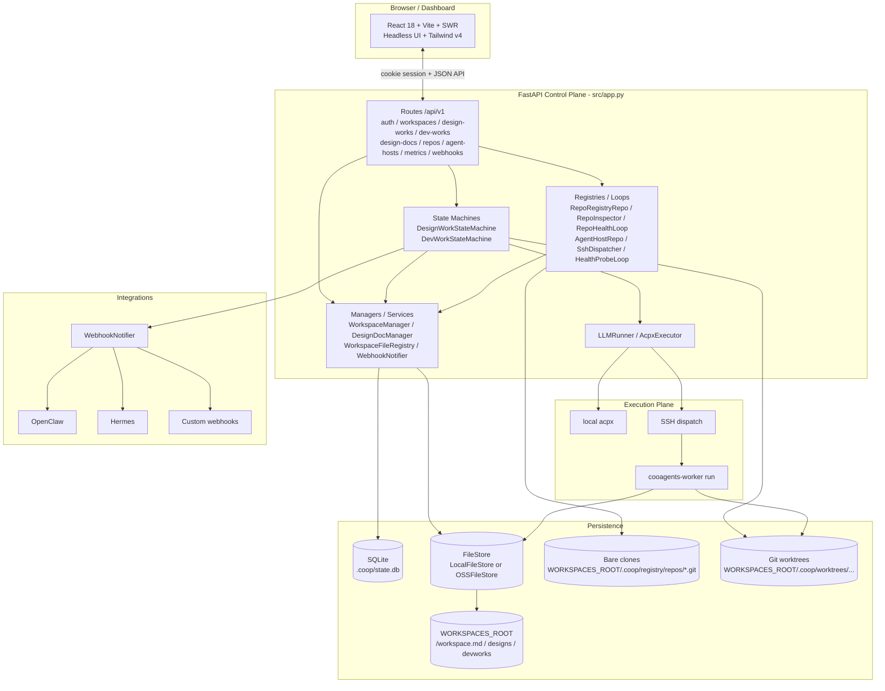
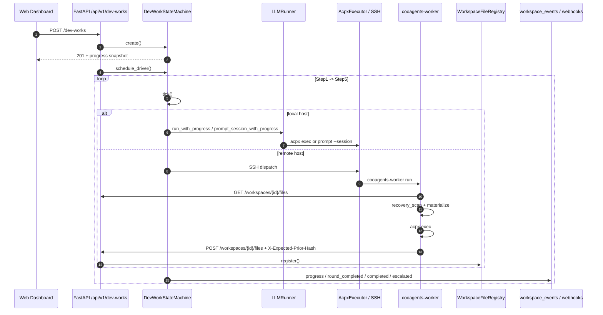
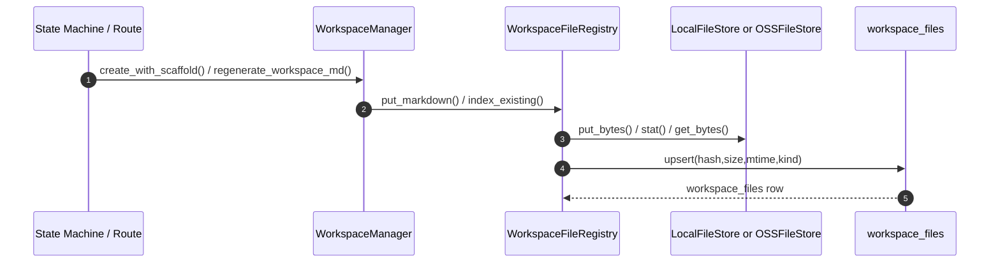
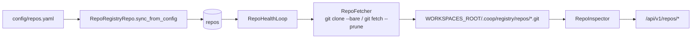
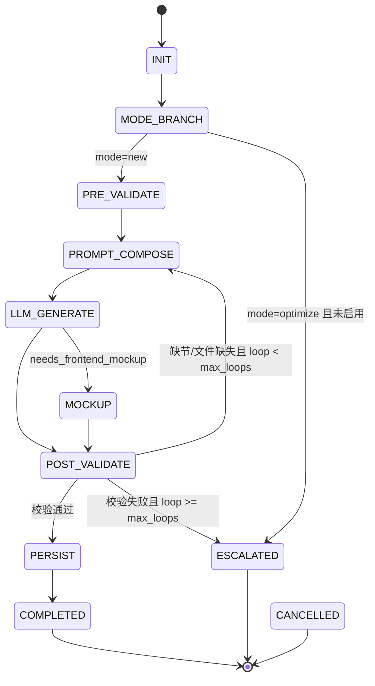
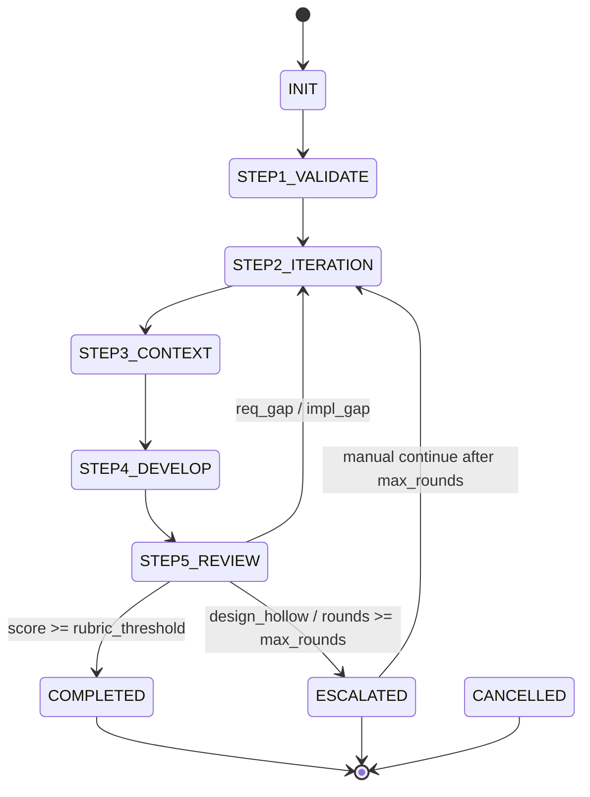

# cooagents

> Workspace 驱动的 Coding Agent 编排控制面。系统用两条可恢复状态机把“设计 -> 开发 -> 评审 -> 回写”串起来，并统一调度本地或远程 SSH 上的 Claude / Codex agent。

[](pyproject.toml)
[](requirements.txt)
[](web/package.json)
[](LICENSE)

---

## 目录

- [概览](#概览)
- [快速开始](#快速开始)
- [架构总览](#架构总览)
- [核心数据流](#核心数据流)
- [状态机](#状态机)
- [模块分层](#模块分层)
- [配置](#配置)
- [部署](#部署)
- [License](#license)

---

## 概览

cooagents 当前是一个单体控制面，但边界已经比较清晰：

- **FastAPI 控制面**：`src/app.py` 负责装配数据库、状态机、Repo Registry、Agent Host Registry、Webhook、限流和 SPA 挂载。
- **双状态机编排**：`DesignWorkStateMachine` 负责设计文档生成与发布，`DevWorkStateMachine` 负责多轮开发、审查和升级/升级失败分流。
- **Workspace 单写链路**：工作区文件统一通过 `WorkspaceManager` / `WorkspaceFileRegistry` 落盘并登记到 `workspace_files`，远端 Worker 也只能通过 API 回写。
- **Repo Registry**：仓库注册、健康抓取、bare clone、只读浏览、分支解析都在 `src/repos/` 内完成。
- **Agent Host 调度**：本地默认走 `acpx`，远端走 `SSH -> cooagents-worker run`，由 `src/agent_hosts/` 和 `src/agent_worker/` 协作完成。
- **Web 控制台**：`web/` 是 React 18 + Vite SPA，覆盖登录、总览、Workspace、DesignWork、DevWork、Repo 浏览等页面。

---

## 快速开始

### 一键安装并启动

```bash
git clone git@github.com:vaxtomis/cooagents.git
cd cooagents
python scripts/deploy.py setup --admin-password "replace-me"
```

`setup` 会做这些事：

1. 检查 Python 3.11+、`git`、`node`、`npm`。
2. 安装 `acpx`（本机不存在时）。
3. 创建 `.venv` 并安装 `requirements.txt`。
4. 执行 `web/npm ci` 和 `web/npm run build`。
5. 初始化 `.coop/state.db`。
6. 生成或补齐 `.env` 中的认证配置。
7. 持久化 `security.workspace_root`，启动 `uvicorn`，并验证 `/health` 与 `/`。

完成后访问 <http://127.0.0.1:8321/>，使用 `admin` 登录。

### 只做基础引导

```bash
python scripts/deploy.py bootstrap
```

兼容脚本仍然保留：

```bash
./scripts/bootstrap.sh
```

它只是 `python scripts/deploy.py bootstrap` 的薄包装。

历史安装说明中的 `/cooagents-setup` 路径仍然保留为兼容示例。

---

## 架构总览



实现上有几个关键点：

- `src/app.py` 是唯一的组合根，启动时把 DB、状态机、Repo/Host Registry、文件存储、Webhook 和后台 loop 全部挂到 `app.state`。
- Dashboard 不是单独服务。`mount_dashboard_spa()` 会把 `web/dist` 挂到同一个 FastAPI 进程下。
- `RepoHealthLoop` 负责维护 bare clone 的抓取状态，`RepoInspector` 只做只读浏览，不会隐式 fetch。
- `HealthProbeLoop` 持续探测 agent host；执行调度与运行状态记录通过 `agent_dispatches` 完成。

### Workspace 与代码落点

```text
<workspace_root>/
├─ <slug>/
│  ├─ workspace.md
│  ├─ designs/
│  │  ├─ DES-<slug>-<version>.md
│  │  └─ .drafts/
│  └─ devworks/
│     └─ <dev_work_id>/
│        ├─ prompts/
│        ├─ context/
│        ├─ artifacts/
│        └─ feedback/
└─ .coop/
   ├─ registry/repos/<repo_id>.git
   └─ worktrees/<branch_safe>/<mount_name>/
```

`workspace.md` 是系统维护的索引文件，会在 Workspace、DesignWork、DevWork 状态变化时自动重渲染，不建议手改。

---

## 核心数据流

### 1. DevWork 执行与回写



说明：

- `INIT` 会先为每个 mount 创建独立 git worktree，再进入 `STEP1_VALIDATE`。
- `STEP2`、`STEP3`、`STEP4`、`STEP5` 的提示词和中间产物都写入 Workspace。
- DevWork 现在优先使用 **session 模式**：
  - `plan`：Step2 独立 session
  - `build`：Step3 与 Step4 使用同名但分离的 session；Step4 进入前会关闭 Step3 的探索上下文
  - `review`：Step5 独立 cold session
- 心跳会把最新进度写进 `dev_works.current_progress_json`，前端 `GET /dev-works/{id}` 可以直接读到。

### 2. Workspace 文件单写链路



这条链路的约束是：

- cooagents 是 `workspace_files` 的唯一写入者。
- 本地产物通过 `put_*()` 或 `index_existing()` 重新登记。
- 远端 Worker 不能直写 DB，只能通过 `POST /workspaces/{id}/files` 回写。
- CAS 语义由 `X-Expected-Prior-Hash` 和 `WorkspaceFileRegistry.register()` 提供，防止远端覆盖未知版本。

### 3. Repo Registry 数据流



---

## 状态机

### DesignWork



当前实现细节：

- `mode=optimize` 默认关闭，`config.design.allow_optimize_mode=false` 时会在 `MODE_BRANCH` 直接升级为 `ESCALATED`。
- `MOCKUP` 目前接的是 `PathMockupRenderer`，主要作为扩展点，默认不会生成真实图片。
- 每轮缺失章节会写进 `missing_sections_json`，下一轮 `PROMPT_COMPOSE` 会把缺失项重新塞回提示词。

### DevWork



当前实现细节：

- `INIT` 会把 `dev_work_repos` 转成每 mount 一个 worktree，并设置主 worktree 与 session anchor。
- `STEP1_VALIDATE` 每次重新校验 `design_doc` 是否仍然是 `published`，并复跑 Markdown 结构校验。
- `STEP2` 先由系统写 iteration note 头部，再让 LLM 追加三段 H2 内容。
- `STEP3` 负责上下文检索，`STEP4` 负责开发与自检，`STEP5` 负责 rubric 审查与分类。
- `req_gap`、`impl_gap` 会回到 `STEP2_ITERATION` 继续下一轮；`design_hollow` 直接升级人工介入。

---

## 模块分层

- `src/app.py`
  FastAPI 入口、lifespan、异常处理、路由挂载、SPA 挂载。
- `routes/`
  纯 HTTP 适配层，暴露 `workspaces`、`design-works`、`dev-works`、`repos`、`agent-hosts`、`metrics`、`webhooks` 等资源。
- `src/workspace_manager.py` + `src/storage/`
  Workspace 目录、`workspace.md` 重建、文件注册、CAS 回写、FileStore 抽象。
- `src/design_work_sm.py`
  DesignWork 的创建、循环校验、发布 DesignDoc。
- `src/dev_work_sm.py` + `src/dev_work_steps.py`
  DevWork 的 worktree/materialize/session/progress/review 编排。
- `src/repos/`
  Repo Registry、fetch/clone、只读 inspector、repo 状态维护。
- `src/agent_hosts/` + `src/agent_worker/`
  SSH 主机探活、远端执行、Worker 物化与差异回传。
- `web/src/`
  Dashboard 路由、页面、hooks、API client、鉴权上下文。
- `templates/`
  DesignWork / DevWork / workspace.md 的模板与提示词骨架。

---

## 配置

配置入口一共四处：

| 文件 | 作用 | 关键项 |
|---|---|---|
| `config/settings.yaml` | 主配置 | `server.host/port`、`security.workspace_root`、`acpx.*`、`design.*`、`devwork.*`、`scoring.*`、`storage.oss.*`、`openclaw.*`、`hermes.*` |
| `config/agents.yaml` | Agent Host Registry | `hosts[]`、`ssh_strict_host_key`、`ssh_known_hosts_path`、`ssh_key_allowed_roots` |
| `config/repos.yaml` | Repo Registry | `repos[]`、`fetch.interval_s`、`fetch.parallel`、`fetch.timeout_s` |
| `.env` | 密钥与认证 | `ADMIN_USERNAME`、`ADMIN_PASSWORD_HASH`、`JWT_SECRET`、`AGENT_API_TOKEN`、`OPENCLAW_HOOK_TOKEN`、`HERMES_WEBHOOK_SECRET`、`OSS_*` |

### 设置加载顺序

1. `config/settings.yaml`
2. 为空的 secret/credential 字段由环境变量补齐
3. 同目录加载 `config/agents.yaml`
4. 同目录加载 `config/repos.yaml`

### 认证与访问控制

- 浏览器侧：`/auth/login` 发放 access/refresh JWT，保存在 `httpOnly` cookie。
- API 客户端：可走 `Authorization: Bearer ...`。
- Agent / Worker：走 `X-Agent-Token`，对应 `.env` 中的 `AGENT_API_TOKEN`。
- 默认 `SameSite=Lax`、`Secure=true`；只在显式设置 `COOAGENTS_ALLOW_INSECURE_COOKIES=1` 时降级。

### 常见配置片段

启用 OSS FileStore：

```yaml
storage:
  oss:
    enabled: true
    bucket: cooagents-prod
    region: cn-hangzhou
    endpoint: https://oss-cn-hangzhou.aliyuncs.com
    prefix: workspaces/
```

再通过环境变量提供：

```bash
export OSS_ACCESS_KEY_ID=...
export OSS_ACCESS_KEY_SECRET=...
```

增加远程 Agent Host：

```yaml
hosts:
  - id: dev-server
    host: dev@10.0.0.5
    agent_type: codex
    max_concurrent: 4
    ssh_key: ~/.ssh/id_rsa
    labels: [fast]
```

增加 Repo Registry 仓库：

```yaml
repos:
  - name: backend
    url: git@github.com:org/backend.git
    default_branch: main
    role: backend
  - name: frontend
    url: git@github.com:org/frontend.git
    default_branch: main
    role: frontend
fetch:
  interval_s: 300
  parallel: 4
```

---

## 部署

### 本地或单机

统一入口是 `scripts/deploy.py`：

```bash
python scripts/deploy.py setup --admin-password "replace-me"
python scripts/deploy.py service status
python scripts/deploy.py service restart
python scripts/deploy.py upgrade --branch main
```

默认绑定地址来自 `config/settings.yaml`：

```yaml
server:
  host: "127.0.0.1"
  port: 8321
```

这意味着：

- 默认只监听本机回环地址。
- 公网访问应放在 Nginx / Caddy 后面，由反向代理终止 HTTPS。
- 进程 pid 写入 `.coop/cooagents.pid`，日志写入 `cooagents.log`。

### 远程 Agent Host

远程执行链路是 `SSH -> cooagents-worker run`。要让它可用，需要两边同时满足条件：

控制面：

- `config/agents.yaml` 中注册目标主机。
- 本机能通过 SSH 访问目标主机。
- `HealthProbeLoop` 能探测到 `acpx --version` 和远端 `WORKSPACES_ROOT` 可写。

远端主机：

- `acpx` 和 `cooagents-worker` 在 `PATH` 上。
- 配置以下环境变量：

```bash
export COOAGENTS_URL=http://control-plane:8321
export COOAGENTS_AGENT_TOKEN=...
export WORKSPACES_ROOT=~/cooagents-workspace
export OSS_BUCKET=...
export OSS_REGION=...
export OSS_ACCESS_KEY_ID=...
export OSS_ACCESS_KEY_SECRET=...
# 可选
export OSS_ENDPOINT=...
export OSS_PREFIX=workspaces/
```

注意：当前 `cooagents-worker` 通过 **OSS 物化工作区文件**，所以启用远程 Worker 前应先开启 `storage.oss.enabled=true`，并在远端提供同一套 OSS 凭证。

### OpenClaw / Hermes 集成

部署脚本已经把运行时集成也统一到同一入口：

```bash
python scripts/deploy.py integrate-runtime --runtime openclaw
python scripts/deploy.py integrate-runtime --runtime hermes
python scripts/deploy.py sync-skills
```

当前集成面包括：

- `WebhookNotifier` 启动时自动 upsert 内置的 OpenClaw / Hermes 订阅。
- `src/skill_deployer.py` 会把本地 `skills/` 同步到配置的 runtime 目录。
- `POST /api/v1/webhooks` 仍可额外注册自定义 webhook 订阅。

---

## License

[MIT](LICENSE)
