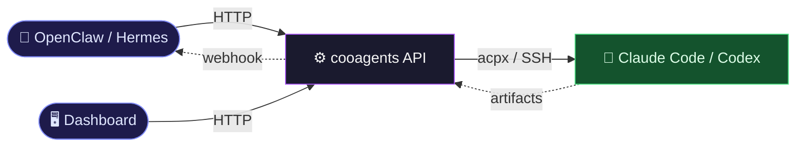
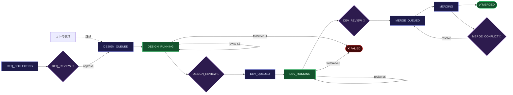

# cooagents

多 Agent 协作流程管理系统 —— 通过 HTTP API 编排 Claude Code / Codex 完成从需求到合并的全生命周期。支持 **OpenClaw** 与 **Hermes** 两种宿主 Agent。



## 目录

- [核心特性](#核心特性)
- [快速启动](#快速启动)
- [宿主集成](#宿主集成)
  - [OpenClaw](#openclaw)
  - [Hermes](#hermes)
- [配置](#配置)
- [工作流阶段](#工作流阶段)
- [API 参考](#api-参考)
- [事件与 Webhook](#事件与-webhook)
- [测试与项目结构](#测试与项目结构)

## 核心特性

- **16 阶段状态机** — 需求 → 设计 → 开发 → 合并，每一步可观测、可控制
- **多轮评估循环** — 产物不达标时自动发送修订指令（设计≤3 轮，开发≤5 轮）
- **三级审批 Gate** — 需求 / 设计 / 开发各独立审批
- **多主机 Agent 池** — 本地 + SSH 远程，按负载自动选择
- **产物版本管理** — SHA256 校验、diff、`.md` / `.docx` 下载（pandoc）
- **三层链路追踪** — Request → Run → Job 全链路 `trace_id`，响应头 `X-Trace-Id`
- **Webhook 通知** — HMAC 签名、事件过滤、失败重试
- **Dashboard** — React + TypeScript，任务列表、详情、产物、事件追踪
- **双宿主适配** — OpenClaw（私有 `/hooks/agent`）与 Hermes（通用 webhook route）

**技术栈：** FastAPI + aiosqlite + asyncssh + Jinja2 + Pydantic v2 + React + TypeScript + Tailwind CSS

## 快速启动

### 环境要求

- Python 3.11+
- git、Node.js（用于安装 `acpx`）
- （可选）pandoc —— `.docx` ↔ `.md` 转换
- （可选）Nginx / Caddy 反向代理 —— 公网部署需终止 HTTPS

### 安装

```bash
git clone git@github.com:vaxtomis/cooagents.git
cd cooagents
bash scripts/bootstrap.sh
```

`bootstrap.sh` 自动完成：Python 校验 → git/node/npm 检查 → acpx 安装 → venv + pip → `web/` 构建 → 校验 `web/dist/index.html` → 目录与 DB 初始化。

如果你想手动复现前端构建步骤，等价命令是：

```bash
cd web
npm ci
npm run build
test -f dist/index.html
```

### 生成启动凭据

公网部署要求以下环境变量，缺一即拒绝启动：`ADMIN_USERNAME`、`ADMIN_PASSWORD_HASH`、`JWT_SECRET`、`AGENT_API_TOKEN`。用内置脚本一次生成：

```bash
.venv/bin/python scripts/generate_password_hash.py --username admin --password '<YOUR_STRONG_PW>'
# 把输出的 4 行写入 .env
umask 077 && .venv/bin/python scripts/generate_password_hash.py \
  --username admin --password '<YOUR_STRONG_PW>' > .env
chmod 600 .env
```

### 启动服务

```bash
set -a && . ./.env && set +a
.venv/bin/uvicorn src.app:app --host 127.0.0.1 --port 8321
```

验证：

| 地址 | 说明 |
|------|------|
| `http://127.0.0.1:8321/` | Dashboard（需登录） |
| `http://127.0.0.1:8321/health` | 健康检查，返回 `{"status":"ok"}` |
| `http://127.0.0.1:8321/docs` | Swagger UI |
| `http://127.0.0.1:8321/redoc` | ReDoc |

> 推荐用 `/cooagents-setup` Skill 代替手工安装 —— 见下节。

## 宿主集成

cooagents 会把 16 阶段工作流事件推送给宿主 Agent；宿主 Agent 通过 Skill 调用 cooagents API（所有请求需带 `X-Agent-Token: $AGENT_API_TOKEN`）。两种宿主对比：

| 维度 | OpenClaw | Hermes |
|------|----------|--------|
| 推送协议 | 私有 `/hooks/agent` + Bearer | 通用 webhook + HMAC-SHA256 |
| Skill 路径 | `~/.openclaw/skills/<name>/` | `~/.hermes/skills/<name>/` |
| CLI | `openclaw` | `hermes` |
| env 写入 | `openclaw config set env.KEY VAL` | 追加到 `$(hermes config env-path)` |
| gateway 重启 | `openclaw restart` | `hermes gateway restart` |

cooagents 启动时由 `src/skill_deployer.py` 自动把仓库内 `skills/` 下三个 Skill（`cooagents-setup`、`cooagents-upgrade`、`cooagents-workflow`）同步到宿主的 skills 目录。详见 [skills/cooagents-setup/references/hermes-integration.md](skills/cooagents-setup/references/hermes-integration.md)。

### OpenClaw

#### 一键安装（推荐）

1. 从仓库复制 `skills/cooagents-setup/` 到 `~/.openclaw/skills/cooagents-setup/`（首次无 cooagents 运行时的引导方式）。
2. 在 OpenClaw 对话中调用 `/cooagents-setup`，按提示填写 `repo_path`、`admin_password`。Skill 会完成安装 + 启动 + 注册 Agent 主机 + 回写 `openclaw.hooks`、`env.AGENT_API_TOKEN`。

#### 手动配置（安装已完成，只补 hooks）

```bash
# 生成 hooks 专用 token（严禁复用 gateway.auth.token）
HOOKS_TOKEN=$(python3 -c 'import secrets; print(secrets.token_hex(32))')

openclaw config set hooks.enabled true --strict-json
openclaw config set hooks.token "$HOOKS_TOKEN"
openclaw config set hooks.defaultSessionKey "hook:ingress"
openclaw config set hooks.allowRequestSessionKey false --strict-json
openclaw config set hooks.allowedSessionKeyPrefixes '["hook:"]' --strict-json

# 注入 AGENT_API_TOKEN 到 OpenClaw 环境
openclaw config set env.AGENT_API_TOKEN "$AGENT_API_TOKEN"

# 在 config/settings.yaml 中把相同 token 配到 openclaw.hooks
```

示例 `settings.yaml`：

```yaml
openclaw:
  deploy_skills: true
  targets:
    - type: local
      skills_dir: "~/.openclaw/skills"
  hooks:
    enabled: true
    url: "http://127.0.0.1:18789/hooks/agent"
    token: "$ENV:OPENCLAW_HOOKS_TOKEN"   # 或直接字面值
```

### Hermes

#### 一键安装（推荐）

1. 从仓库复制 `skills/cooagents-setup/` 到 `~/.hermes/skills/cooagents-setup/`。
2. 在 Hermes 中调用 `/cooagents-setup`，Skill 识别到当前宿主为 `hermes` 后会执行 **C-6B Hermes 分支**：生成 HMAC secret、写入 `~/.hermes/.env`、注册 webhook route、订阅 cooagents webhook、注入 `AGENT_API_TOKEN`。

#### 手动配置

```bash
# 1. 生成 HMAC secret
HERMES_SECRET=$(python3 -c 'import secrets; print(secrets.token_hex(32))')

# 2. 写入 Hermes 环境（供 webhook route 引用）
printf "HERMES_WEBHOOK_SECRET=%s\n" "$HERMES_SECRET" >> "$(hermes config env-path)"
printf "AGENT_API_TOKEN=%s\n"       "$AGENT_API_TOKEN" >> "$(hermes config env-path)"
chmod 600 "$(hermes config env-path)"

# 3. 把 secret 同步到 cooagents .env
printf "\nHERMES_WEBHOOK_SECRET=%s\n" "$HERMES_SECRET" >> /path/to/cooagents/.env
```

在 Hermes `config.yaml` 的 `platforms.webhook.extra.routes` 下追加一条 `cooagents` 路由：

```yaml
platforms:
  webhook:
    enabled: true
    extra:
      host: 127.0.0.1
      port: 8644
      routes:
        cooagents:
          events: ["*"]
          secret: "${HERMES_WEBHOOK_SECRET}"
          skills: ["cooagents-workflow"]
          prompt: |
            cooagents 推送事件：{event_type}
            run_id: {run_id}
            ticket: {ticket}

            payload: {payload}
          deliver: "log"
```

重启 Hermes gateway 并在 cooagents `settings.yaml` 启用：

```yaml
hermes:
  enabled: true
  skills_dir: "~/.hermes/skills"
  deploy_skills: true
  webhook:
    enabled: true
    url: "http://127.0.0.1:8644/webhooks/cooagents"
    secret: "$ENV:HERMES_WEBHOOK_SECRET"
```

最后向 cooagents 注册一条 webhook 订阅（HMAC 与 Hermes route 的 secret 相同）：

```bash
curl -X POST http://127.0.0.1:8321/api/v1/webhooks \
  -H "X-Agent-Token: $AGENT_API_TOKEN" \
  -H "Content-Type: application/json" \
  -d "{\"url\":\"http://127.0.0.1:8644/webhooks/cooagents\",
       \"events\":[\"gate.waiting\",\"run.completed\",\"run.failed\",\"merge.conflict\"],
       \"secret\":\"$HERMES_SECRET\"}"
```

#### 验证

```bash
# 无签名时应返回 401，签名正确时返回 202
curl -s -X POST http://127.0.0.1:8644/webhooks/cooagents \
  -H "Content-Type: application/json" -d '{"ping":"1"}' -o /dev/null -w "%{http_code}\n"

# Hermes 拿到 AGENT_API_TOKEN
hermes exec 'echo $AGENT_API_TOKEN'
```

> `openclaw` 与 `hermes` 两个分支可以同时启用（`{runtime}=both`）；状态机 `POST /tick` 本身幂等，重复投递不会产生重复 approve。

## 配置

### `config/settings.yaml`（关键字段）

```yaml
server: { host: 0.0.0.0, port: 8321 }
database: { path: .coop/state.db }
timeouts: { dispatch_startup: 300, design_execution: 1800, dev_execution: 3600 }
acpx: { permission_mode: approve-all, ttl: 600 }
turns: { design_max_turns: 3, dev_max_turns: 5 }
tracing: { enabled: true, retention_days: 7 }

# 二选一或两者并存
openclaw: { hooks: { enabled: false, url: "...", token: "..." } }
hermes:   { webhook: { enabled: false, url: "...", secret: "..." } }
```

### `config/agents.yaml`

```yaml
hosts:
  - id: local-pc
    host: local
    agent_type: both        # claude + codex
    max_concurrent: 2
  - id: dev-server
    host: dev@10.0.0.5      # SSH 远程
    agent_type: codex
    max_concurrent: 4
    ssh_key: ~/.ssh/id_rsa
```

### `.env`（安装时生成，权限 600）

```
ADMIN_USERNAME=...
ADMIN_PASSWORD_HASH=...
JWT_SECRET=...
AGENT_API_TOKEN=...
HERMES_WEBHOOK_SECRET=...     # 仅 Hermes 启用时
```

## 工作流阶段



- 🚦 审批 Gate：需调 `approve` / `reject` 推进
- 📄 上传需求：`POST /runs/upload-requirement` 上传 `.md` / `.docx` 直接跳至 `DESIGN_QUEUED`
- revise：产物缺失时自动发送修订指令，达到上限强制推进到 REVIEW
- 中断/超时进入 `FAILED`，可 `retry` / `recover`

完整阶段表见 [docs/PROCESS.md](docs/PROCESS.md)。

## API 参考

核心端点（完整 Swagger 见 `/docs`）：

| 分组 | 端点 | 说明 |
|------|------|------|
| Run | `POST /api/v1/runs` | 创建任务 |
| Run | `POST /api/v1/runs/upload-requirement` | 上传需求文档（multipart） |
| Run | `POST /api/v1/runs/{id}/tick` | 推进一步 |
| Run | `POST /api/v1/runs/{id}/approve` `...reject` | Gate 审批 |
| Run | `POST /api/v1/runs/{id}/retry` `...recover` `...resolve-conflict` | 恢复 |
| Artifact | `GET /api/v1/runs/{id}/artifacts[/{aid}/content\|diff\|download]` | 产物 |
| Host | `GET /POST/PUT/DELETE /api/v1/agent-hosts` | 主机池 |
| Webhook | `POST/GET/DELETE /api/v1/webhooks` | 订阅 |
| Trace | `GET /api/v1/runs/{id}/trace` `/jobs/{jid}/diagnosis` `/traces/{trace_id}` | 链路诊断 |

所有请求需 `X-Agent-Token: $AGENT_API_TOKEN`；所有响应带 `X-Trace-Id`。

示例：

```bash
# 创建任务
curl -X POST http://127.0.0.1:8321/api/v1/runs \
  -H "X-Agent-Token: $AGENT_API_TOKEN" \
  -H "Content-Type: application/json" \
  -d '{"ticket":"PROJ-42","repo_path":"/path/to/repo",
       "repo_url":"git@github.com:user/project.git"}'

# 审批设计
curl -X POST http://127.0.0.1:8321/api/v1/runs/{id}/approve \
  -H "X-Agent-Token: $AGENT_API_TOKEN" \
  -H "Content-Type: application/json" \
  -d '{"gate":"design","by":"reviewer"}'
```

OpenClaw 16 函数定义见 [docs/openclaw-tools.json](docs/openclaw-tools.json)。

## 事件与 Webhook

| 类别 | 事件（节选） |
|------|----------|
| 阶段 | `stage.changed` |
| Gate | `gate.waiting` `gate.approved` `gate.rejected` |
| Job | `job.completed` `job.failed` `job.timeout` `job.interrupted` |
| Run | `run.completed` `run.cancelled` `run.failed` `run.retried` |
| 合并 | `merge.completed` `merge.conflict` `merge.conflict_resolved` |
| 主机 | `host.online` `host.offline` `host.unavailable` |
| 会话 | `session.created` `session.closed` |
| 追踪 | `request.received` `request.completed` `request.error` |

订阅示例：

```bash
curl -X POST http://127.0.0.1:8321/api/v1/webhooks \
  -H "X-Agent-Token: $AGENT_API_TOKEN" \
  -H "Content-Type: application/json" \
  -d '{"url":"https://your-callback","secret":"hmac-secret",
       "events":["gate.waiting","run.completed","merge.conflict"]}'
```

投递使用 `X-Signature-256: sha256=<hex>` 的 HMAC 头（与 Hermes route 兼容）。

## 测试与项目结构

```bash
pytest tests/ -v                    # 285 tests
pytest tests/test_state_machine.py  # 单模块
```

目录速览：

```
cooagents/
├── config/          # settings.yaml、agents.yaml
├── db/schema.sql    # 10 表
├── docs/            # PROCESS.md、openclaw-tools.json、CODEMAPS（本地）
├── scripts/         # bootstrap.sh、generate_password_hash.py
├── skills/          # cooagents-{setup,upgrade,workflow}/ —— 启动时部署到宿主
├── src/             # FastAPI、状态机、acpx、skill_deployer 等
├── routes/          # HTTP 路由
├── templates/       # Jinja2 任务指令模板
├── tests/           # pytest 套件
└── web/             # React + TS + Tailwind Dashboard
```

## License

MIT
