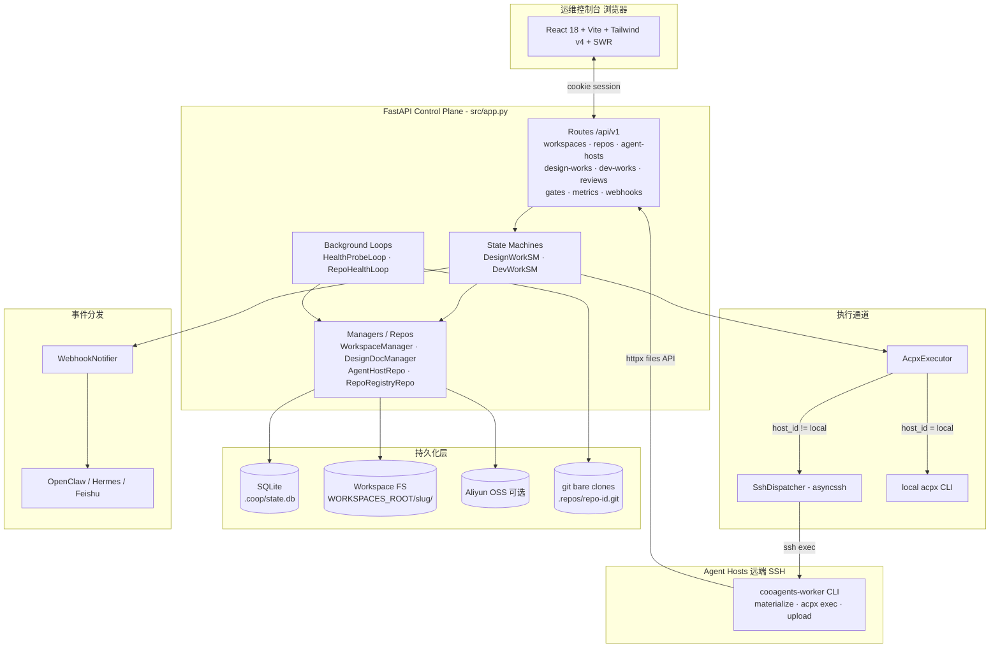
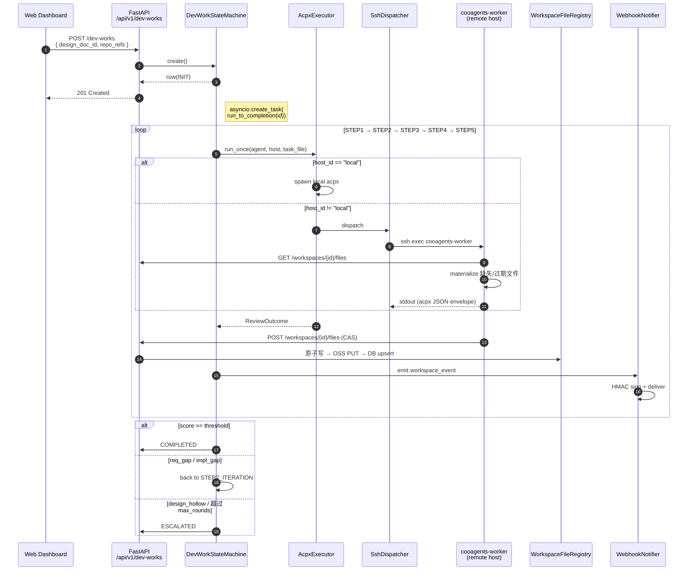
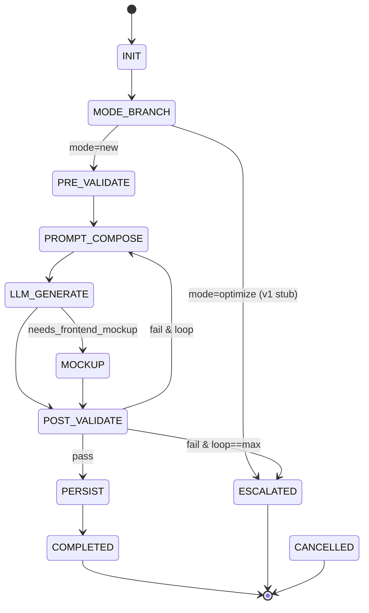
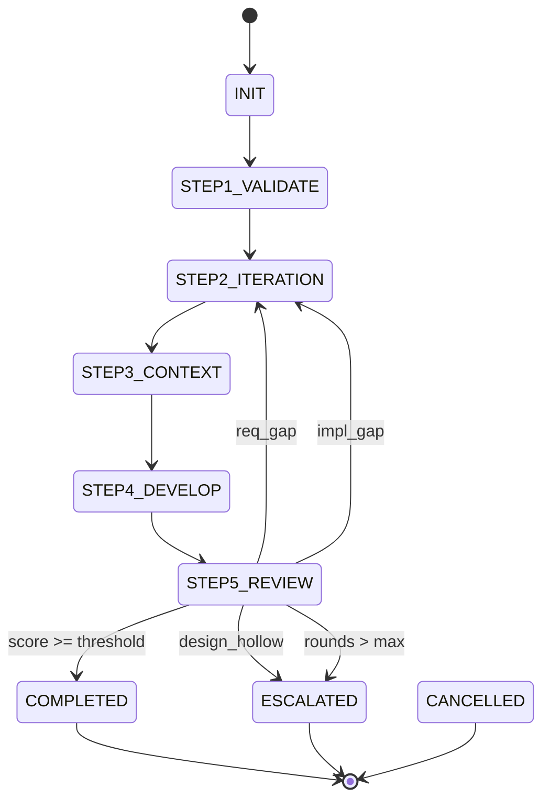
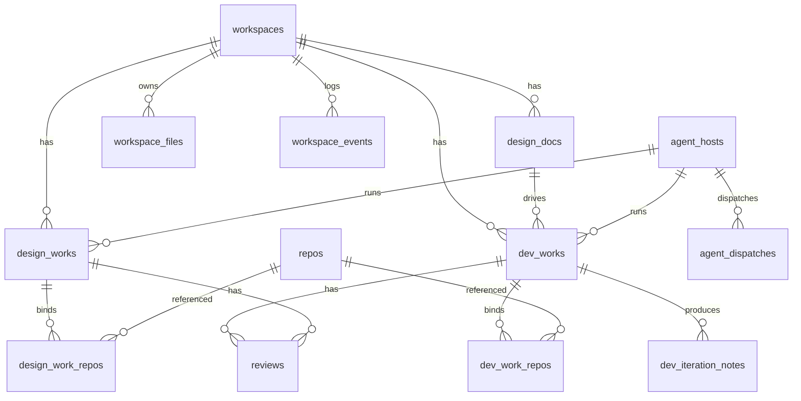

# cooagents

> Workspace 驱动的 Coding Agent 编排平台 —— 把 **设计 → 评审 → 开发 → 评审** 的研发闭环建模为两条可恢复的状态机，统一调度本地或远端 SSH 上的 Claude / Codex agent。

[](pyproject.toml)
[](requirements.txt)
[](web/package.json)
[](LICENSE)

---

## 目录

- [功能概览](#功能概览)
- [快速开始](#快速开始)
- [架构总览](#架构总览)
- [核心数据流](#核心数据流)
- [状态机模型](#状态机模型)
- [数据模型](#数据模型)
- [目录结构](#目录结构)
- [配置](#配置)
- [运行与部署](#运行与部署)
- [开发](#开发)
- [文档](#文档)

---

## 功能概览

cooagents 围绕这四件事构建：

- **状态机优先** —— `DesignWorkStateMachine` 与 `DevWorkStateMachine` 把每一步的中间产物落到 SQLite + 工作区文件，任何 tick 都是幂等的。
- **Workspace 即工作目录** —— 每一个项目就是一个 workspace，包含 `designs/`、`devworks/`、镜像挂载的多仓 worktree。
- **Repo Registry + Agent Host Registry** —— 注册一次，全局复用；后台健康循环持续 `git fetch` / SSH probe。
- **三段式持久化** —— 本地原子写 → DB upsert → OSS PUT，由 `WorkspaceFileRegistry` 单写者保证一致性。
- **Web 控制台** —— 一个 React SPA 看完概览、Workspace、设计/开发详情、Repo 浏览。

---

## 快速开始

### 一键 bootstrap（推荐）

```bash
git clone git@github.com:vaxtomis/cooagents.git
cd cooagents
./scripts/bootstrap.sh
```

`bootstrap.sh` 会：

1. 检查 `python ≥ 3.11` / `git` / `node` / `npm`；
2. 全局安装 `acpx`（如已存在则跳过）；
3. 创建 `.venv` 并 `pip install -r requirements.txt`；
4. `cd web && npm ci && npm run build`；
5. 创建 `.coop/`，并应用 `db/schema.sql` 初始化 SQLite。

启动：

```bash
uvicorn src.app:app --host 0.0.0.0 --port 8321
```

打开 <http://127.0.0.1:8321/>，使用 `admin` 账号登录（密码哈希通过 `scripts/generate_password_hash.py` 生成并写入 `.env`）。

### 用 Skill 安装（OpenClaw / Hermes 宿主）

如果你跑在 OpenClaw 或 Hermes Agent 中，直接调用：

```text
/cooagents-setup
```

Skill 会识别 runtime、收集 `repo_path` / `admin_password`、运行 `bootstrap.sh`、起服务、注册本地 Agent 主机并回写 `AGENT_API_TOKEN`。

---

## 架构总览



**控制平面只有一个进程**（FastAPI / uvicorn），它是 **唯一的 DB 写者** 和 **唯一的 OSS 写者**。Agent 主机即便跑在远端，也通过 `POST /workspaces/{id}/files` 回流文件，绝不直连 DB / OSS。

---

## 核心数据流

### DevWork：从一个 prompt 到 5 步走完



### 多仓 DevWork 工作区结构

```
WORKSPACES_ROOT/
└── <slug>/                              # 一个 workspace
    ├── workspace.md                      # 元数据 (FS-wins reconcile 锚点)
    ├── designs/
    │   ├── DES-login-1.0.0.md            # published 版本
    │   └── .drafts/<desw-id>-input.md    # 用户输入
    ├── devworks/
    │   └── <dev-work-id>/
    │       ├── iteration-round-1.md      # Step2 输出
    │       ├── context.md                # Step3 输出
    │       └── review.md                 # Step5 输出
    └── repos/                            # multi-repo 挂载点
        ├── frontend/                     # mount_name (UNIQUE per dev_work)
        ├── backend/
        └── infra/
```

---

## 状态机模型

### DesignWork (D0 → D7)



### DevWork (Step1 → Step5)



两条状态机的 step handler 都是 **幂等的**：通过 `gates_json` 记录已完成动作，重启后从断点继续；后台 task 由 `asyncio.create_task(run_to_completion(id))` 驱动，前端通过 `POST /{kind}/{id}/tick` 触发单步推进。

#### DevWork 每 round 三会话（Phase 9+）

每个 DevWork round 启动 3 个 acpx session：`dw-<id>-r<N>-plan`（Step2，cold）、`dw-<id>-r<N>-build`（Step3+Step4 共享，warm 复用 worktree-scan cache）、`dw-<id>-r<N>-review`（Step5，cold，独立 judge 视角避免 LLM-as-judge bias）。Round 收尾或 DevWork 终止时 SM 通过 `LLMRunner.delete_session` 回收；启动时 `orphan_sweep_at_boot` 清理上次进程崩溃残留。每个 session 锚定在 `<workspaces_root>/<slug>/devworks/<dev_id>/`（持久化到 `dev_works.session_anchor_path`），LLM 通过 prompt 中的 mount table 切到具体 mount worktree。默认 `permission_mode=approve-all`，避免每步交互阻塞。

---

## 数据模型



DB 层的关键不变量：

| # | 不变量 | 实现 |
|---|-------|------|
| 1 | 同一 design_doc 同时只能有一个活跃 DevWork | partial UNIQUE `uniq_dev_works_active_per_design_doc` |
| 2 | 一个 DevWork 至多一个 primary repo | partial UNIQUE `uniq_dev_work_repos_primary` |
| 3 | review 至少绑定 dev_work 或 design_work 之一 | CHECK 约束 |
| 4 | 保留 `local` agent host 永远存在 | `INSERT OR IGNORE` |
| 5 | 仍被引用的 repo 不可删除 | FK `ON DELETE RESTRICT` |

完整 schema 见 [`db/schema.sql`](db/schema.sql)；表与字段说明见 [docs/CODEMAPS/data.md](docs/CODEMAPS/data.md)。

---

## 目录结构

```
cooagents/
├── src/                       # FastAPI 控制平面
│   ├── app.py                  # 入口 + lifespan + SPA mount
│   ├── auth.py / config.py / database.py / models.py
│   ├── design_work_sm.py / design_doc_manager.py / design_prompt_composer.py / design_validator.py
│   ├── dev_work_sm.py / dev_work_steps.py / dev_iteration_note_manager.py / dev_prompt_composer.py
│   ├── workspace_manager.py / workspace_events.py
│   ├── acpx_executor.py / mockup_renderer.py / reviewer.py / semver.py
│   ├── webhook_events.py / webhook_notifier.py
│   ├── skill_deployer.py / file_converter.py / git_utils.py / path_validation.py
│   ├── agent_hosts/            # host registry + SSH + probe
│   ├── agent_worker/           # cooagents-worker CLI
│   ├── repos/                  # Repo Registry + fetcher + inspector
│   └── storage/                # FileStore (local / OSS) + WorkspaceFileRegistry
├── routes/                    # FastAPI 路由（auth_required 由 src/app.py 注入）
├── web/                       # React 控制台 (Vite + TS + Tailwind v4)
│   ├── src/
│   │   ├── pages/ components/ hooks/ lib/ api/ auth/ types/
│   │   ├── router.tsx main.tsx App.tsx
│   └── dist/                   # FastAPI 在 lifespan 中挂载
├── db/schema.sql              # 单文件 schema (drop & rebuild 模式)
├── config/                    # settings.yaml / agents.yaml / repos.yaml
├── templates/                 # Step1–5 / DesignDoc / workspace.md 提示词模板
├── skills/                    # cooagents-setup · cooagents-upgrade
├── scripts/                   # bootstrap.sh, generate_password_hash.py, sim_worker.py, audit_filesystem_writes.py
├── tests/                     # pytest (asyncio_mode=auto)
└── pyproject.toml requirements.txt
```

---

## 配置

三个 YAML 文件 + 一份 `.env`：

| 文件 | 作用 |
|------|------|
| [`config/settings.yaml`](config/settings.yaml) | server / database / timeouts / acpx / design / scoring / openclaw / hermes / storage |
| [`config/agents.yaml`](config/agents.yaml) | Agent host registry 基线、SSH `strict_host_key`、`ssh_key_allowed_roots` |
| [`config/repos.yaml`](config/repos.yaml) | Repo Registry 基线、`fetch.interval_s` / `parallel` |
| [`.env`](.env.example) | OSS 凭证、`FEISHU_WEBHOOK_URL`、`OPENCLAW_HOOK_TOKEN`、`HERMES_WEBHOOK_SECRET` |

启用 OSS 备份：

```yaml
# config/settings.yaml
storage:
  oss:
    enabled: true
    bucket: cooagents-prod
    region: cn-hangzhou
    endpoint: https://oss-cn-hangzhou.aliyuncs.com
    prefix: workspaces/
```

并 export `OSS_ACCESS_KEY_ID` / `OSS_ACCESS_KEY_SECRET`。

---

## 运行与部署

### 本地

```bash
# Terminal 1 — backend
uvicorn src.app:app --host 0.0.0.0 --port 8321 --reload

# Terminal 2 — frontend (热更新)
cd web && npm run dev
```

### 生产

- 把 FastAPI 绑定到 `127.0.0.1:8321`，由 nginx / Caddy 终止 HTTPS。
- 把 `.coop/` 与 `WORKSPACES_ROOT` 放到持久化卷。
- 设置 `acpx.permission_mode: approve-all`（默认）。

### 远端 Agent Host

在远端机器：

```bash
pip install "cooagents[worker]"
# 控制面 SSH 过来时，会执行 cooagents-worker，无需手工启动
```

控制面侧在 `config/agents.yaml` 里加一行：

```yaml
hosts:
  - id: dev-server
    host: dev@10.0.0.5
    agent_type: codex
    max_concurrent: 4
    ssh_key: ~/.ssh/id_rsa
    labels: [fast]
```

`HealthProbeLoop` 会按 `health_check.interval` 持续 SSH 探活并落库 `agent_hosts.health_status`。

---

## 开发

```bash
# 运行后端测试
pytest

# 覆盖率
pytest --cov=src --cov-report=term-missing

# 跑 OSS 集成测试（需要凭证 + OSS_RUN_SLOW=1）
OSS_RUN_SLOW=1 pytest -m integration

# 前端单测
cd web && npm test

# 前端 build（含 tsc 双 project 校验）
cd web && npm run build
```

测试目录约定：
- `tests/test_*.py` — 单元 + 集成；`asyncio_mode=auto`
- `tests/integration/` — 跨模块端到端；`@pytest.mark.integration`
- `tests/test_smoke_e2e*.py` — 烟雾测试，覆盖 Workspace + DesignWork + DevWork + Repo Registry 主流程

辅助脚本：

| 脚本 | 用途 |
|------|------|
| `scripts/bootstrap.sh` | 一键安装 + 初始化 DB + 构建 SPA |
| `scripts/generate_password_hash.py` | 生成 argon2 哈希给 admin 账号 |
| `scripts/sim_worker.py` | 模拟 cooagents-worker 行为，用于无远端机器时调试 SSH 链路 |
| `scripts/audit_filesystem_writes.py` | 审计哪些代码路径绕过 `WorkspaceFileRegistry`，回归"单写者"不变量 |

---

## 文档

- [docs/CODEMAPS/architecture.md](docs/CODEMAPS/architecture.md) — 系统拓扑、模块图
- [docs/CODEMAPS/backend.md](docs/CODEMAPS/backend.md) — 路由表 / 中间件 / 服务依赖
- [docs/CODEMAPS/frontend.md](docs/CODEMAPS/frontend.md) — 页面树 / 组件 / hooks
- [docs/CODEMAPS/data.md](docs/CODEMAPS/data.md) — Schema 详解 / 不变量
- [docs/CODEMAPS/dependencies.md](docs/CODEMAPS/dependencies.md) — Python / Node 依赖、外部服务
- [docs/design/](docs/design/) — DES / ADR 模板
- [docs/dev/](docs/dev/) — PLAN / TEST-REPORT 模板

---

## License

[MIT](LICENSE)
