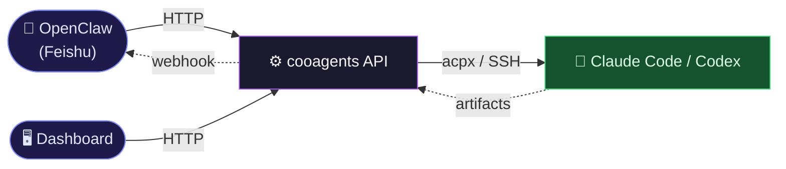
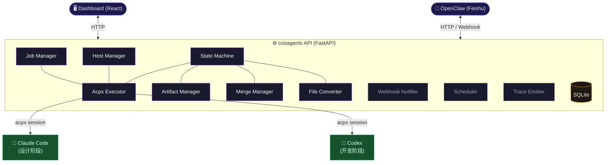
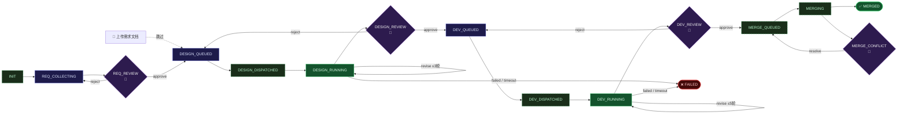
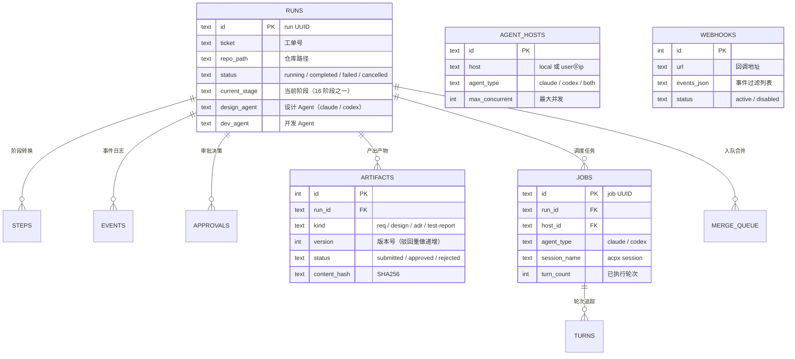

# cooagents

多 Agent 协作流程管理系统 —— 通过 HTTP API 编排 Claude Code / Codex 完成从需求到合并的全生命周期。



## 目录

- [核心特性](#核心特性)
- [架构概览](#架构概览)
- [快速启动](#快速启动)
- [配置说明](#配置说明)
- [工作流阶段](#工作流阶段)
- [API 参考](#api-参考)
- [模板系统](#模板系统)
- [数据库设计](#数据库设计)
- [OpenClaw 集成](#openclaw-集成)
  - [cooagents-workflow Skill](#cooagents-workflow-skill)
  - [cooagents-setup Skill](#cooagents-setup-skill)
  - [cooagents-upgrade Skill](#cooagents-upgrade-skill)
  - [API 参考文档](#api-参考文档)
  - [OpenClaw Skill 部署](#openclaw-skill-部署)
- [测试](#测试)
- [项目结构](#项目结构)

## 核心特性

- **16 阶段状态机** — 从需求收集到代码合并，每个阶段可观测、可控制
- **需求文档上传** — 支持上传 `.md` / `.docx` 需求文档直接跳过需求阶段，`.docx` 自动通过 pandoc 转换
- **多轮评估循环** — RUNNING 阶段自动评估产物质量，不达标则向 Agent 发送修订指令（设计最多 3 轮，开发最多 5 轮）
- **acpx Session 管理** — 基于 acpx CLI 的持久化会话，支持多轮交互、断点恢复、超时控制
- **三级审批 Gate** — 需求 / 设计 / 开发各设独立审批节点，支持驳回重做
- **产物版本管理** — 需求文档、设计文档、ADR、测试报告等产物自动扫描、哈希校验、版本追踪；弹框查看支持 Markdown 渲染，下载支持 `.md` / `.docx` 格式
- **Dashboard** — React + TypeScript 前端，任务列表、创建任务（含文件拖拽上传）、运行详情、产物查看、Agent 输出、事件追踪
- **多主机 Agent 池** — 支持本地 + SSH 远程主机，按负载自动选择，独立健康检查
- **优先级合并队列** — FIFO + 优先级排序，冲突检测，自动 rebase
- **Webhook 事件通知** — HMAC 签名、事件过滤、失败重试，24 种事件类型
- **Jinja2 模板引擎** — 灵活的任务指令模板，支持条件逻辑和循环
- **三层链路追踪** — Request → Run → Job 全链路 `trace_id` 关联，`X-Trace-Id` 响应头自动传播，三个诊断 API 支持 OpenClaw 自主排查

## 架构概览



**技术栈：** FastAPI + aiosqlite + asyncssh + Jinja2 + Pydantic v2 + React + TypeScript + Tailwind CSS

**角色分工：**

| 角色 | 职责 | 执行方式 |
|------|------|----------|
| **OpenClaw** | 需求沟通确认、任务分配、Gate 审批 | 飞书对话 → HTTP API |
| **Claude Code** | 需求理解、功能设计、ADR 编写 | acpx session（`claude` 后端） |
| **Codex** | 编码实现、测试编写、代码提交 | acpx session（`codex` 后端） |

## 快速启动

### 环境要求

- Python 3.11+
- git
- Node.js（用于安装 acpx）
- `acpx` CLI（bootstrap 脚本会自动安装，已有则跳过）

### 安装

```bash
git clone git@github.com:vaxtomis/cooagents.git
cd cooagents
bash scripts/bootstrap.sh
```

bootstrap 脚本会自动完成：Python ≥3.11 校验 → git/node/npm 检查 → acpx 安装（已有则跳过）→ venv 创建 + Python 依赖安装 → 在 `web/` 目录执行 `npm ci` 和 `npm run build` → 校验 `web/dist/index.html` → 运行目录创建 → 数据库初始化。

### 启动服务

```bash
uvicorn src.app:app --host 0.0.0.0 --port 8321
```

启动后访问 API 文档：

| 地址 | 说明 |
|------|------|
| `http://0.0.0.0:8321/` | Dashboard（返回 HTML） |
| `http://0.0.0.0:8321/docs` | Swagger UI（交互式） |
| `http://0.0.0.0:8321/redoc` | ReDoc（阅读式） |
| `http://0.0.0.0:8321/health` | 健康检查 |

## 配置说明

### 服务配置 (`config/settings.yaml`)

```yaml
server:
  host: 0.0.0.0
  port: 8321

database:
  path: .coop/state.db

timeouts:
  dispatch_startup: 300      # Agent 启动超时（秒）
  design_execution: 1800     # 设计阶段超时
  dev_execution: 3600        # 开发阶段超时
  review_reminder: 86400     # 审批提醒间隔

health_check:
  interval: 60               # 健康检查间隔
  ssh_timeout: 5

merge:
  auto_rebase: true
  max_resume_count: 3

acpx:
  permission_mode: approve-all
  default_format: json
  ttl: 600                   # Session 空闲超时
  json_strict: true           # 严格 JSON 输出
  model: null                 # 留空使用 agent 默认模型
  allowed_tools_design: null  # 设计阶段工具白名单（逗号分隔）
  allowed_tools_dev: null     # 开发阶段工具白名单

turns:
  design_max_turns: 3        # 设计阶段最大轮次
  dev_max_turns: 5           # 开发阶段最大轮次

tracing:
  enabled: true                  # 启用链路追踪
  retention_days: 7              # 已终结 run 的事件保留天数
  debug_retention_days: 3        # debug 级别事件保留天数
  orphan_retention_days: 3       # 无关联 run 的事件保留天数
  cleanup_interval_hours: 24     # 清理循环间隔

openclaw:
  deploy_skills: true          # 启动时是否同步 Skill
  targets:
    - type: local
      skills_dir: "~/.openclaw/skills"
  hooks:
    enabled: false             # 是否推送事件到 OpenClaw
    url: "http://127.0.0.1:18789/hooks/agent"
    token: ""
    default_channel: "last"
    default_to: ""
```

### Agent 主机配置 (`config/agents.yaml`)

```yaml
hosts:
  - id: local-pc
    host: local              # 本地执行
    agent_type: both         # claude + codex
    max_concurrent: 2

  - id: dev-server
    host: dev@10.0.0.5       # SSH 远程执行
    agent_type: codex
    max_concurrent: 4
    ssh_key: ~/.ssh/id_rsa
    labels:
      - gpu
      - high-memory
```

### 环境变量 (`.env`)

```bash
FEISHU_WEBHOOK_URL=          # 飞书 Webhook 回调地址（可选）
COOAGENTS_CONFIG_DIR=config  # 配置目录
COOAGENTS_COOP_DIR=.coop     # 运行时状态目录
```

## 工作流阶段



- **🚦 审批 Gate** — 需要调用 `approve` 或 `reject` 端点通过
- **📄 上传需求文档** — 上传 `.md` / `.docx` 文件直接跳过 REQ 阶段进入 DESIGN_QUEUED
- **revise** — 自动检查产物完整性，不通过则发送修订指令继续

### 各阶段详细说明

| 阶段 | 触发方式 | 说明 |
|------|----------|------|
| `INIT` | 系统自动 | 创建 run 后立即转入 REQ_COLLECTING |
| `REQ_COLLECTING` | `submit-requirement` | 等待提交需求文档；也可通过 `upload-requirement` 上传文件直接跳到 DESIGN_QUEUED |
| `REQ_REVIEW` | `approve` / `reject` | 人工审批需求 |
| `DESIGN_QUEUED` | `tick` | 等待可用 Claude 主机 |
| `DESIGN_DISPATCHED` | 自动 | acpx session 已启动 |
| `DESIGN_RUNNING` | 自动 | Agent 工作中，完成后自动评估产物 |
| `DESIGN_REVIEW` | `approve` / `reject` | 人工审批设计方案 |
| `DEV_QUEUED` | `tick` | 等待可用 Codex 主机 |
| `DEV_DISPATCHED` | 自动 | acpx session 已启动 |
| `DEV_RUNNING` | 自动 | Agent 工作中，完成后自动评估产物 |
| `DEV_REVIEW` | `approve` / `reject` | 人工审批代码 |
| `MERGE_QUEUED` | 自动 | 进入合并队列 |
| `MERGING` | 自动 | 执行合并 |
| `MERGE_CONFLICT` | `resolve-conflict` | 合并冲突，等待人工解决后重新入队 |
| `MERGED` | 自动 | 完成 |
| `FAILED` | 自动 | Job 失败/超时/中断时进入，可通过 `retry` 恢复 |

### 多轮评估机制

在 `DESIGN_RUNNING` 和 `DEV_RUNNING` 阶段，Agent 完成工作后状态机会自动评估产物：

**设计阶段检查项：**
- `DES-{ticket}.md` — 设计文档
- `ADR-{ticket}.md` — 架构决策记录

**开发阶段检查项：**
- `TEST-REPORT-{ticket}.md` — 测试报告

如果缺少必需产物，系统会通过 `send_followup` 向 Agent 发送修订指令（TURN-revision / TURN-dev-fix 模板），并保持在 RUNNING 阶段。每轮修订记录在 `turns` 表中，达到上限后强制推进到 REVIEW 阶段。

## API 参考

### 工作流 (`/api/v1/runs`)

| 方法 | 路径 | 说明 |
|------|------|------|
| `POST` | `/runs` | 创建任务 |
| `POST` | `/runs/upload-requirement` | 上传需求文档创建任务（multipart，支持 `.md` / `.docx`，跳过 REQ 阶段） |
| `GET` | `/runs` | 列出任务（支持 `status`/`limit`/`offset` 过滤） |
| `GET` | `/runs/{id}` | 任务详情（含 steps、approvals、events、artifacts） |
| `POST` | `/runs/{id}/tick` | 推进一步 |
| `POST` | `/runs/{id}/submit-requirement` | 提交需求文档 |
| `POST` | `/runs/{id}/approve` | 审批通过（`gate`: req/design/dev） |
| `POST` | `/runs/{id}/reject` | 驳回（`gate` + `reason`） |
| `POST` | `/runs/{id}/retry` | 重试失败任务 |
| `POST` | `/runs/{id}/recover` | 恢复中断任务（`action`: resume/redo/manual） |
| `POST` | `/runs/{id}/resolve-conflict` | 合并冲突解决后重新入队（`by`） |
| `DELETE` | `/runs/{id}` | 取消任务 |

### 产物 (`/api/v1/runs/{id}/artifacts`)

| 方法 | 路径 | 说明 |
|------|------|------|
| `GET` | `/artifacts` | 列出产物（支持 `kind`/`status` 过滤） |
| `GET` | `/artifacts/{aid}` | 产物元数据 |
| `GET` | `/artifacts/{aid}/content` | 产物内容 |
| `GET` | `/artifacts/{aid}/diff` | 与上一版本的 diff |
| `GET` | `/artifacts/{aid}/download` | 下载产物（`?format=md\|docx`，docx 通过 pandoc 转换） |

### Job 与合并 (`/api/v1/runs/{id}`)

| 方法 | 路径 | 说明 |
|------|------|------|
| `GET` | `/runs/{id}/jobs` | 列出 Agent 任务 |
| `GET` | `/runs/{id}/jobs/{jid}/output` | Agent 输出内容 |
| `GET` | `/runs/{id}/conflicts` | 合并冲突详情 |
| `POST` | `/runs/{id}/merge` | 入队合并（支持 `priority`） |
| `POST` | `/runs/{id}/merge-skip` | 跳过合并 |

### Agent 主机 (`/api/v1/agent-hosts`)

| 方法 | 路径 | 说明 |
|------|------|------|
| `GET` | `/agent-hosts` | 列出所有主机 |
| `POST` | `/agent-hosts` | 注册新主机 |
| `PUT` | `/agent-hosts/{id}` | 更新主机配置 |
| `DELETE` | `/agent-hosts/{id}` | 移除主机 |
| `POST` | `/agent-hosts/{id}/check` | 健康检查 |

### Webhook (`/api/v1/webhooks`)

| 方法 | 路径 | 说明 |
|------|------|------|
| `POST` | `/webhooks` | 创建订阅 |
| `GET` | `/webhooks` | 列出所有订阅 |
| `DELETE` | `/webhooks/{id}` | 移除订阅 |
| `GET` | `/webhooks/{id}/deliveries` | 投递记录 |

### 诊断与追踪 (`/api/v1`)

| 方法 | 路径 | 说明 |
|------|------|------|
| `GET` | `/runs/{id}/trace` | Run 事件链路（支持 `level`/`span_type`/`limit`/`offset`） |
| `GET` | `/jobs/{jid}/diagnosis` | Job 故障诊断（错误摘要、堆栈、轮次、主机状态） |
| `GET` | `/traces/{trace_id}` | 按 trace_id 查询完整链路 |

所有 API 响应携带 `X-Trace-Id` 响应头，可用于跨请求关联。

### 仓库视图 (`/api/v1/repos`)

| 方法 | 路径 | 说明 |
|------|------|------|
| `POST` | `/repos/ensure` | 确保仓库存在（clone / init） |
| `GET` | `/repos` | 列出仓库或按仓库查询 run |
| `GET` | `/repos/merge-queue` | 合并队列状态 |

### 使用示例

```bash
# 创建任务
curl -X POST http://127.0.0.1:8321/api/v1/runs \
  -H "Content-Type: application/json" \
  -d '{"ticket": "PROJ-42", "repo_path": "/path/to/repo", "repo_url": "git@github.com:user/project.git"}'

# 提交需求
curl -X POST http://127.0.0.1:8321/api/v1/runs/{run_id}/submit-requirement \
  -H "Content-Type: application/json" \
  -d '{"content": "# 需求标题\n## 背景\n..."}'

# 上传需求文档创建任务（跳过 REQ 阶段）
curl -X POST http://127.0.0.1:8321/api/v1/runs/upload-requirement \
  -F "file=@/path/to/REQ-PROJ-42.md" \
  -F "ticket=PROJ-42" \
  -F "repo_path=/path/to/repo"

# 审批通过设计
curl -X POST http://127.0.0.1:8321/api/v1/runs/{run_id}/approve \
  -H "Content-Type: application/json" \
  -d '{"gate": "design", "by": "reviewer-name"}'

# 驳回并说明原因
curl -X POST http://127.0.0.1:8321/api/v1/runs/{run_id}/reject \
  -H "Content-Type: application/json" \
  -d '{"gate": "design", "by": "reviewer-name", "reason": "缺少错误处理方案"}'

# 推进状态
curl -X POST http://127.0.0.1:8321/api/v1/runs/{run_id}/tick

# 查看详情
curl http://127.0.0.1:8321/api/v1/runs/{run_id}
```

## 模板系统

使用 Jinja2 引擎渲染 Agent 任务指令，模板位于 `templates/` 目录：

| 模板 | 用途 | 触发时机 |
|------|------|----------|
| `INIT-design.md` | 设计阶段初始任务 | DESIGN_QUEUED → DISPATCHED |
| `INIT-dev.md` | 开发阶段初始任务 | DEV_QUEUED → DISPATCHED |
| `TURN-revision.md` | 设计轮次修订指令 | 设计评估不通过时 |
| `TURN-dev-fix.md` | 开发轮次修复指令 | 开发评估不通过时 |
| `GATE-revision.md` | Gate 驳回后修订指令 | 审批驳回后重新调度 |
| `RESUME.md` | 中断恢复指令 | `recover` 操作 |
| `WEBHOOK-messages.yaml` | 事件通知消息模板 | Webhook 投递时 |

模板变量示例：`{{ ticket }}`、`{{ worktree }}`、`{{ feedback }}`、`{{ turn }}`

## 数据库设计

SQLite 数据库包含 10 张表：



| 表 | 说明 |
|----|------|
| `runs` | 工作流 run 记录，含状态、阶段、worktree 路径 |
| `steps` | 阶段转换历史（from → to） |
| `events` | 事件审计日志（含 trace_id、job_id、span_type、level、duration_ms、error_detail、source） |
| `approvals` | Gate 审批决策（approved / rejected） |
| `artifacts` | 产物版本，含 SHA256 哈希、字节大小、审批状态 |
| `jobs` | Agent 任务记录，含 session name、轮次计数 |
| `turns` | 每轮修订的提示文件、评估结果 |
| `agent_hosts` | 主机池，含负载、状态、SSH 配置 |
| `merge_queue` | 合并队列，含优先级和冲突文件 |
| `webhooks` | Webhook 订阅配置 |

## OpenClaw 集成

### cooagents-workflow Skill

项目内置了面向 OpenClaw 的 Skill（`skills/cooagents-workflow/`），使 OpenClaw Agent 自动扮演**项目经理**角色，通过 `exec` + `curl` 编排 cooagents 16 阶段工作流。

```
skills/cooagents-workflow/
├── SKILL.md                    # 核心决策逻辑（~150 行，注入 Agent prompt）
└── references/
    ├── api-playbook.md         # 8 个 curl 操作场景（按需 Read）
    ├── error-handling.md       # 自动错误恢复策略
    └── feishu-interaction.md   # 3 类回复消息模板
```

**Skill 能力：**

| 操作 | 模式 | 说明 |
|------|------|------|
| 创建任务、提交需求、tick 推进 | 自动 | Agent 通过 `exec curl` 直接调用 API |
| 监控 RUNNING 状态 | 自动 | 响应 webhook 事件或轮询 |
| 需求/设计/开发审批 | 人工 | Agent 格式化审批模板回复用户，等待用户消息后执行 approve/reject |
| 超时/失败恢复 | 自动 | 按策略自动 retry/recover，超限后通知用户 |
| 合并冲突 | 人工 | 通知用户并附冲突文件列表 |

**部署机制：** cooagents 启动时，`src/skill_deployer.py` 自动将 `skills/` 目录同步到 OpenClaw 的托管 skills 目录（默认 `~/.openclaw/skills/`），支持本地复制和 SSH 远程部署。配置见 [OpenClaw Skill 部署](#openclaw-skill-部署)。

### cooagents-setup Skill

项目内置了安装引导 Skill（`skills/cooagents-setup/`），使 OpenClaw Agent 能够**自主完成 cooagents 的安装与启动**，无需人工逐步操作。

```
skills/cooagents-setup/
├── SKILL.md                    # 4 阶段安装编排（注入 Agent prompt）
└── references/
    └── troubleshooting.md      # 10 类常见问题排查（按需 Read）
```

Skill 调用 `scripts/bootstrap.sh` 完成环境检查、依赖安装和 Dashboard 本地构建，自身专注于编排和容错：

**安装流程（4 阶段）：**

| 阶段 | 动作 | 成功判定 |
|------|------|----------|
| ① 定位代码 | 检查 `repo_path` 或 `git clone` | `src/app.py` 和 `config/settings.yaml` 存在 |
| ② 运行 bootstrap | `bash scripts/bootstrap.sh` | 退出码 0，且 bootstrap 包含 `npm ci`、`npm run build` 并生成 `web/dist/index.html` |
| ③ 启动服务 + 健康检查 | 平台相关启动命令 + 轮询 `/health` + 校验 `/` | 返回 `"status": "ok"`，且根路径返回 HTML |
| ④ 注册 Agent 主机 | `POST /api/v1/agent-hosts` | 本地主机已注册 |

安装完成后自动注册本地 Agent 主机（`agent_type: both`，并发上限 2）。

**首次安装（引导问题）：** cooagents-setup Skill 由 cooagents 启动时自动部署到 OpenClaw，但首次安装时 cooagents 尚未运行。解决方式：
1. **手动放置**：从仓库复制 `skills/cooagents-setup/` 到 `~/.openclaw/skills/cooagents-setup/`，然后调用 `/cooagents-setup`
2. **从已 clone 的仓库**：告诉 OpenClaw Agent 读取 `{repo_path}/skills/cooagents-setup/SKILL.md` 并按指示操作
3. **后续自动**：首次安装成功后，cooagents 启动时自动部署 Skill

### cooagents-upgrade Skill

项目内置了升级 Skill（`skills/cooagents-upgrade/`），使 OpenClaw Agent 能够**自主将运行中的 cooagents 升级到最新版本**。

```
skills/cooagents-upgrade/
├── SKILL.md                    # 5 阶段升级编排（注入 Agent prompt）
└── references/
    └── troubleshooting.md      # 6 类升级问题排查（按需 Read）
```

**升级流程（5 阶段）：**

| 阶段 | 动作 | 成功判定 |
|------|------|----------|
| ① 检查当前状态 | 健康检查 + 活跃任务检测 + 记录旧版本 | 服务可达 |
| ② 拉取最新代码 | `git pull origin main` | 无冲突，有新内容 |
| ③ 更新依赖和数据库 | `bash scripts/bootstrap.sh` | 退出码 0，且重新构建 Dashboard |
| ④ 重启服务 | 停止旧进程 → 启动新进程 | 进程已启动 |
| ⑤ 验证升级 | 健康检查 + 根路径校验 + 版本对比 | `"status": "ok"`、根路径返回 HTML，且 commit 已变更 |

**安全特性：** 升级前自动检查是否有运行中的任务并警告用户；无新代码时跳过后续步骤；DB 自动备份支持回退。

### API 参考文档

`docs/openclaw-tools.json` 提供了 16 个函数调用定义，可作为 API 参考：

| 函数 | 对应 API |
|------|----------|
| `ensure_repo` | `POST /api/v1/repos/ensure` |
| `create_task` | `POST /api/v1/runs` |
| `list_tasks` | `GET /api/v1/runs` |
| `get_task_status` | `GET /api/v1/runs/{id}` |
| `tick_task` | `POST /api/v1/runs/{id}/tick` |
| `submit_requirement` | `POST /api/v1/runs/{id}/submit-requirement` |
| `approve_gate` | `POST /api/v1/runs/{id}/approve` |
| `reject_gate` | `POST /api/v1/runs/{id}/reject` |
| `retry_task` | `POST /api/v1/runs/{id}/retry` |
| `recover_task` | `POST /api/v1/runs/{id}/recover` |
| `cancel_task` | `DELETE /api/v1/runs/{id}` |
| `list_artifacts` | `GET /api/v1/runs/{id}/artifacts` |
| `get_artifact_content` | `GET /api/v1/runs/{id}/artifacts/{aid}/content` |
| `get_run_trace` | `GET /api/v1/runs/{id}/trace` |
| `get_job_diagnosis` | `GET /api/v1/jobs/{jid}/diagnosis` |
| `get_trace` | `GET /api/v1/traces/{trace_id}` |

### 配置 Webhook 接收通知

```bash
curl -X POST http://127.0.0.1:8321/api/v1/webhooks \
  -H "Content-Type: application/json" \
  -d '{
    "url": "https://your-openclaw-callback/webhook",
    "secret": "your-hmac-secret",
    "events": ["gate.waiting", "run.completed", "merge.conflict"]
  }'
```

### 支持的事件类型

| 类别 | 事件 |
|------|------|
| 阶段 | `stage.changed` |
| Gate | `gate.waiting` `gate.approved` `gate.rejected` |
| Job | `job.completed` `job.failed` `job.interrupted` `job.timeout` `job.error` |
| Run | `run.completed` `run.cancelled` `run.retried` `run.failed` |
| 合并 | `merge.completed` `merge.conflict` `merge.conflict_resolved` |
| 主机 | `host.online` `host.offline` |
| 轮次 | `turn.started` `turn.completed` |
| Session | `session.created` `session.closed` `session.ensure_timeout` `session.ensure_failed` |
| 追踪 | `request.received` `request.completed` `request.error` `stage.transition` `run.failed` |
| 调度器 | `scheduler.health_check_error` `scheduler.timeout_enforcement_error` |
| 数据库 | `db.lock_retry` |
| 其他 | `review.reminder` `requirement.submitted` `requirement.uploaded` |

### OpenClaw Skill 部署

cooagents 启动时自动将 `skills/` 目录下的 Skill 同步到 OpenClaw。在 `config/settings.yaml` 中配置：

```yaml
openclaw:
  deploy_skills: true              # 启动时是否同步 Skill
  targets:
    - type: local                  # 本地复制
      skills_dir: "~/.openclaw/skills"
    # - type: ssh                  # 远程部署（规划中）
    #   host: "remote-host"
    #   port: 22
    #   user: "deploy"
    #   key: "~/.ssh/id_rsa"
    #   skills_dir: "~/.openclaw/skills"
```

部署流程：
1. 扫描 `skills/` 下包含 `SKILL.md` 的子目录
2. 对每个目标执行全量同步（先清除旧文件，再复制新文件）
3. 日志记录部署结果

OpenClaw 发现 Skill 后，Agent 在对话中检测到相关意图时会自动加载对应 Skill。用户也可通过 `/cooagents-workflow`、`/cooagents-setup` 或 `/cooagents-upgrade` 直接调用。

## 测试

```bash
# 运行全部测试
pytest tests/ -v

# 运行特定模块
pytest tests/test_state_machine.py -v
pytest tests/test_e2e.py -v
pytest tests/test_acpx_executor.py -v
```

测试覆盖（285 个测试）：

| 模块 | 测试数 | 说明 |
|------|--------|------|
| `test_state_machine.py` | 63 | 状态转换、Gate、多轮评估、reconciliation、需求上传跳阶段 |
| `test_acpx_executor.py` | 42 | 命令构建、session 管理、exit code |
| `test_openclaw_hooks.py` | 19 | OpenClaw hooks 事件推送 |
| `test_api.py` | 19 | HTTP 端点集成测试（含上传需求文档） |
| `test_host_manager.py` | 14 | 选择、负载、健康检查 |
| `test_diagnostics.py` | 13 | 诊断 API（run trace、job diagnosis、trace lookup） |
| `test_run_brief.py` | 12 | Run 摘要视图 |
| `test_database.py` | 10 | 连接、事务、tracing schema migration |
| `test_config.py` | 9 | 配置加载、默认值、TracingConfig |
| `test_webhook_notifier.py` | 8 | 订阅、过滤、投递 |
| `test_scheduler.py` | 8 | 启动、停止、超时执行 |
| `test_merge_manager.py` | 8 | 队列、优先级、冲突 |
| `test_artifact_manager.py` | 7 | 注册、版本、Jinja2 渲染 |
| `test_job_manager.py` | 7 | session、轮次追踪 |
| `test_trace_emitter.py` | 6 | 事件发射器、队列消费、format_error |
| `test_skill_deployer.py` | 6 | Skill 部署、覆盖、SSH 降级 |
| `test_git_utils.py` | 6 | worktree、冲突检测 |
| `test_file_converter.py` | 6 | 上传验证、docx 转换 |
| `test_trace_context.py` | 5 | contextvars 传播、任务隔离 |
| `test_ensure_repo.py` | 5 | ensure_repo init/clone/exists |
| `test_bootstrap_flow.py` | 5 | 启动引导流程 |
| `test_e2e.py` | 4 | 完整流程、驳回重做、取消、重试 |
| `test_trace_middleware.py` | 3 | X-Trace-Id 中间件 |

## 项目结构

```
cooagents/
├── config/
│   ├── agents.yaml            # Agent 主机配置
│   └── settings.yaml          # 服务配置（含 OpenClaw 部署配置）
├── db/
│   └── schema.sql             # 数据库 Schema（10 表）
├── docs/
│   ├── PROCESS.md             # 流程说明
│   ├── openclaw-tools.json    # OpenClaw API 参考（16 函数）
│   ├── design/                # 设计文档模板
│   └── dev/                   # 开发文档模板
├── pencil/
│   └── dashboard.pen          # Dashboard 设计稿（Pencil 格式）
├── skills/                    # OpenClaw Skills（启动时部署）
│   ├── cooagents-workflow/
│   │   ├── SKILL.md           # 核心决策逻辑
│   │   └── references/        # 参考文档（api-playbook, error-handling, feishu-interaction）
│   ├── cooagents-setup/
│   │   ├── SKILL.md           # 4 阶段安装流程
│   │   └── references/        # 排查文档（troubleshooting）
│   └── cooagents-upgrade/
│       ├── SKILL.md           # 5 阶段升级流程
│       └── references/        # 排查文档（troubleshooting）
├── routes/                    # FastAPI 路由
│   ├── runs.py                # 工作流端点（含 upload-requirement）
│   ├── artifacts.py           # 产物端点（含下载 / docx 转换）
│   ├── repos.py               # 仓库 / 合并端点
│   ├── agent_hosts.py         # 主机管理端点
│   ├── webhooks.py            # Webhook 端点
│   └── diagnostics.py         # 诊断 API 端点（trace / diagnosis）
├── src/                       # 核心模块
│   ├── app.py                 # FastAPI 应用入口
│   ├── state_machine.py       # 16 阶段状态机
│   ├── acpx_executor.py       # acpx session 执行器
│   ├── artifact_manager.py    # 产物版本管理
│   ├── file_converter.py      # 文件验证与格式转换（md ↔ docx，pandoc）
│   ├── host_manager.py        # 多主机管理
│   ├── job_manager.py         # Job / 轮次追踪
│   ├── merge_manager.py       # 合并队列
│   ├── webhook_notifier.py    # Webhook 通知
│   ├── scheduler.py           # 后台调度器
│   ├── database.py            # 异步 SQLite
│   ├── skill_deployer.py      # OpenClaw Skill 部署
│   ├── config.py              # 配置加载
│   ├── trace_context.py       # 链路追踪上下文（contextvars）
│   ├── trace_emitter.py       # 事件发射器（async queue + batch write）
│   ├── trace_middleware.py    # X-Trace-Id 中间件
│   ├── models.py              # Pydantic 模型
│   ├── git_utils.py           # Git 操作工具
│   └── exceptions.py          # 自定义异常
├── web/                       # Dashboard 前端
│   ├── src/
│   │   ├── api/               # API 客户端（apiFetch、runs、client）
│   │   ├── components/        # 通用组件（StageProgress、StatusBadge 等）
│   │   ├── pages/             # 页面（RunsListPage、RunDetailPage 等）
│   │   ├── hooks/             # 自定义 Hooks（useSSE、usePolling）
│   │   ├── types/             # TypeScript 类型定义
│   │   └── index.css          # Tailwind 主题 + Markdown prose 样式
│   ├── package.json
│   └── vite.config.ts         # Vite + React + Tailwind v4
├── templates/                 # Jinja2 任务模板
├── tests/                     # 测试套件（285 tests）
├── scripts/
│   └── bootstrap.sh           # 初始化脚本
├── requirements.txt
└── pyproject.toml
```

## 依赖

| 包 | 版本 | 用途 |
|----|------|------|
| fastapi | >=0.110 | HTTP API 框架 |
| uvicorn | >=0.29 | ASGI 服务器 |
| aiosqlite | >=0.20 | 异步 SQLite |
| asyncssh | >=2.14 | SSH 远程执行 |
| pydantic | >=2.0 | 数据验证 |
| jinja2 | >=3.1 | 模板渲染 |
| pyyaml | >=6.0 | YAML 配置 |
| httpx | >=0.27 | HTTP 客户端（Webhook） |
| python-multipart | >=0.0.9 | 文件上传（multipart/form-data） |

**可选依赖：**

| 工具 | 用途 |
|------|------|
| pandoc | `.docx` ↔ `.md` 格式转换（上传需求文档、下载产物为 Word） |

## License

MIT
